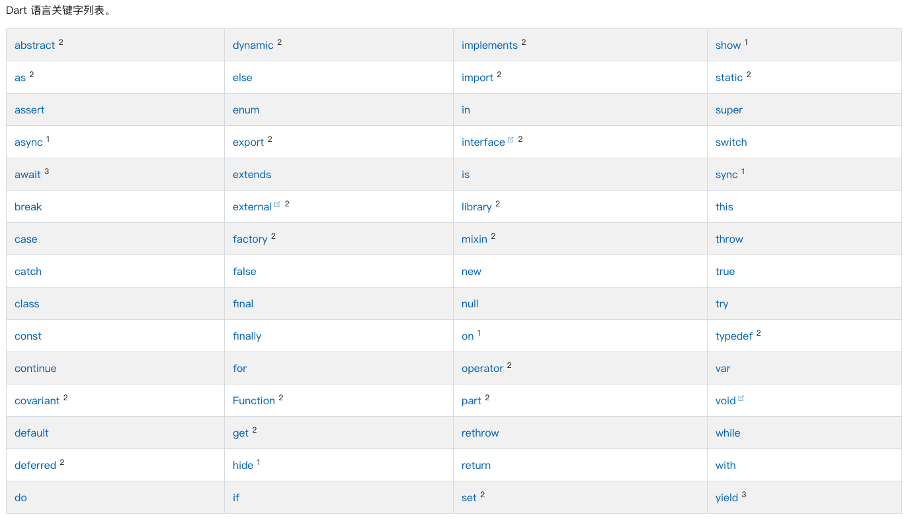

## 1、重要的概念

在学习 Dart 语言时, 应该基于以下事实和概念：

* 任何保存在变量中的都是一个 对象 ， 并且所有的对象都是对应一个 类 的实例。 无论是数字，函数和 null 都是对象。所有对象继承自 Object 类。

* 尽管 Dart 是强类型的，但是 Dart 可以推断类型，所以类型注释是可选的。 在上面的代码中， number 被推断为 int 类型。 如果要明确说明不需要任何类型， 需要使用特殊类型 dynamic 。

* Dart 支持泛型，如 List <int> （整数列表）或 List <dynamic> （任何类型的对象列表）。

* Dart 支持顶级函数（例如 main（） ）， 同样函数绑定在类或对象上（分别是 静态函数 和 实例函数 ）。 以及支持函数内创建函数 （ 嵌套 或 局部函数 ） 。

* 类似地， Dart 支持顶级 变量 ， 同样变量绑定在类或对象上（静态变量和实例变量）。 实例变量有时称为字段或属性。

* 与 Java 不同，Dart 没有关键字 “public” ， “protected” 和 “private” 。 如果标识符以下划线（\ _）开头，则它相对于库是私有的。 有关更多信息，参考 库和可见性。

* 标识符 以字母或下划线（\ _）开头，后跟任意字母和数字组合。

* Dart 语法中包含 表达式（ expressions ）（有运行时值）和 语句（ statements ）（没有运行时值）。 例如，条件表达式 condition ? expr1 : expr2 的值可能是 expr1 或 expr2 。 将其与 if-else 语句 相比较，if-else 语句没有值。 一条语句通常包含一个或多个表达式，相反表达式不能直接包含语句。

* Dart 工具提示两种类型问题：警告和错误。 警告只是表明代码可能无法正常工作，但不会阻止程序的执行。 错误可能是编译时错误或者运行时错误。 编译时错误会阻止代码的执行; 运行时错误会导致代码在执行过程中引发异常。

## 2、关键字



---

Dart中所有东西都是对象，包括数字、函数等，它们都继承自 Object，并且默认值都是 null（包括数字），因此数字、字符串都可以调用各种方法。

Dart 语言虽然是一种强类型语言，但类型是可选的，可以使用 var、const、final 声明变量和常量，还可以在声明的时候指定类型，如

```
var str = "str";
String str1 = "str";

const str = "str";
const String str = "str";
```

Dart 内置了 num(int,double)、bool、String、List、Map、Set 等类型。
