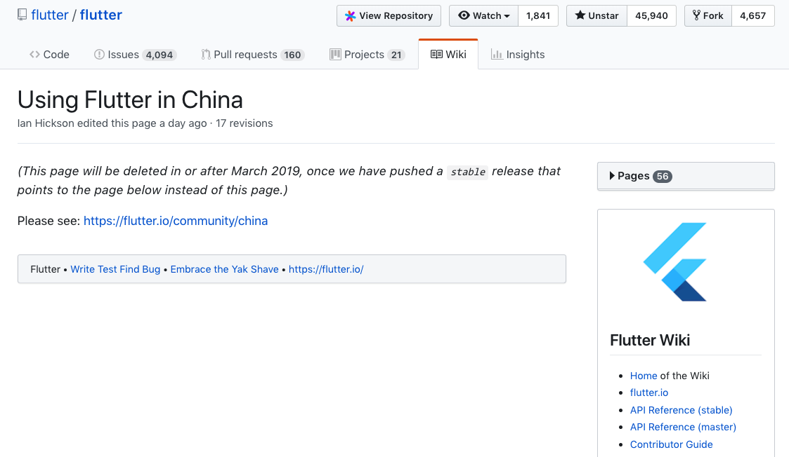

#### 1、配置国内的镜像站点

国内用户建议配置一个与官方同步的可信的镜像站点，帮助 Flutter 命令行工具到该镜像站点下载其所需的资源，来加速安装和使用，为此需要设置两个环境变量：“PUB_HOSTED_URL”和“FLUTTER_STORAGE_BASE_URL”，然后再运行 Flutter 命令行工具。配置方法如下：

```
export PUB_HOSTED_URL=https://pub.flutter-io.cn
export FLUTTER_STORAGE_BASE_URL=https://storage.flutter-io.cn
```

目前可用的镜像站点有两个：

* 上海交通大学 Linux 用户组  
FLUTTER_STORAGE_BASE_URL: https://mirrors.sjtug.sjtu.edu.cn  
PUB_HOSTED_URL: https://dart-pub.mirrors.sjtug.sjtu.edu.cn  

* Flutter 社区  
FLUTTER_STORAGE_BASE_URL: https://storage.flutter-io.cn  
PUB_HOSTED_URL: https://pub.flutter-io.cn  

更多信息请翻阅：[Using Flutter in China](https://github.com/flutter/flutter/wiki/Using-Flutter-in-China) | [Flutter 社区中文资源-使用镜像](https://flutter-io.cn/#section-china-mirror) 

---

2018年12月13日更新：

[Using Flutter in China](https://github.com/flutter/flutter/wiki/Using-Flutter-in-China) 该页面已经提示会被删除，作为代替，需要访问 [Using Flutter in China](https://flutter.io/community/china)

