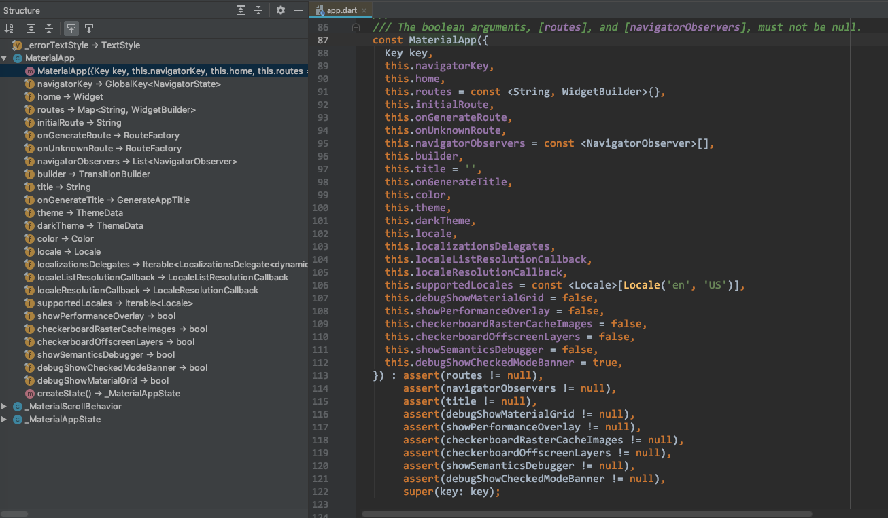

## 1. 概述

MaterialApp 继承自 StatefulWidget（`class MaterialApp extends StatefulWidget`），常用的属性有 title、home、theme 等。它的 title 属性在 Android 上用于多任务管理界面显示在 App 旁边，在 iOS 上没有用到。



## 2. 属性详解

#### 2.x primaryColor

默认的 primaryColor 为 Colors.blue，源代码如下：

```
brightness ??= Brightness.light;
final bool isDark = brightness == Brightness.dark;
primarySwatch ??= Colors.blue;
primaryColor ??= isDark ? Colors.grey[900] : primarySwatch;
```

#### 2.x theme 属性

`final ThemeData theme`

theme 属性为 ThemeData 类型。

ThemeData 见 ThemeData.md