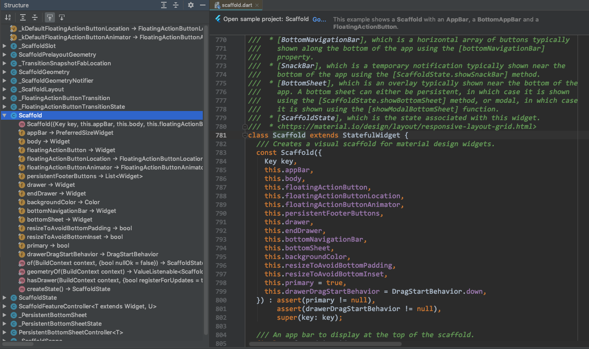

## 1. 概述

Scaffold 继承自 StatefulWidget（`class Scaffold extends StatefulWidget`），常用的属性有 appBar、body、floatingActionButton、drawer、endDrawer、bottomNavigationBar、bottomSheet 等。

## 2. xx

FloatingActionButtonLocation 有如下这些值:

* FloatingActionButtonLocation.endFloat
* FloatingActionButtonLocation.endDocked
* FloatingActionButtonLocation.centerFloat
* FloatingActionButtonLocation.centerDocked
* FloatingActionButtonLocation.startTop
* FloatingActionButtonLocation.miniStartTop
* FloatingActionButtonLocation.endTop

endFloat 为默认值。