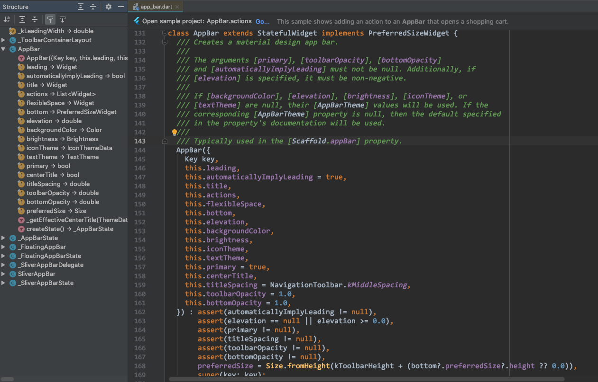

## 1. 概述

AppBar 继承自 StatefulWidget（`class AppBar extends StatefulWidget implements PreferredSizeWidget`），常用的属性有 title、actions、centerTitle、titleSpacing、leading 等。



## 2. xx


## x. PopupMenuButton

```
var _abs  = ["A", "B", "C"];
PopupMenuButton(
    onSelected: (i) => print(i),
    icon: Icon(Icons.more_vert, color:Colors.red),
    itemBuilder: (context) => List.generate(_abs.length,(index) => PopupMenuItem()value: _abs[index], child: Text(_abs[index]))) 
)
```

---

## 透明状态栏

```
void main() {
    runApp(DemoApp());
    
    if (Platform.isAndroid) {
        var style = SystemUiOverlayStyle(statusBarColor: Colors.transparent);
        SystemChrome.setSystemUIOverlayStyle(style);
    }
}
```

```
return Scafflold(
    appBar: AppBar(
        flexbleSpace: Image.asset("assets/images/xx.png", fit: BoxFit.cover),
    ),
);
```
