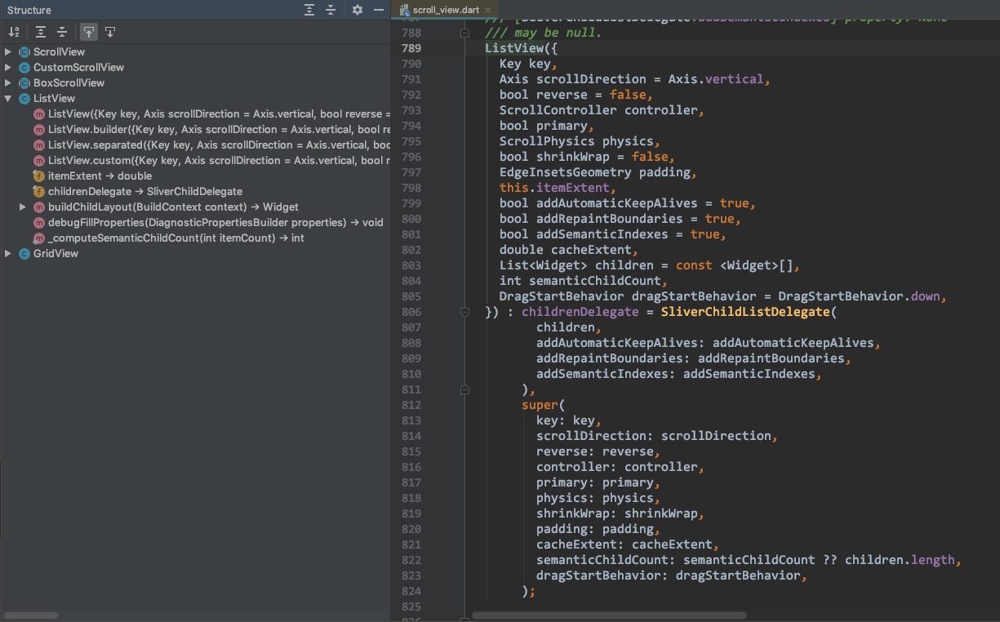
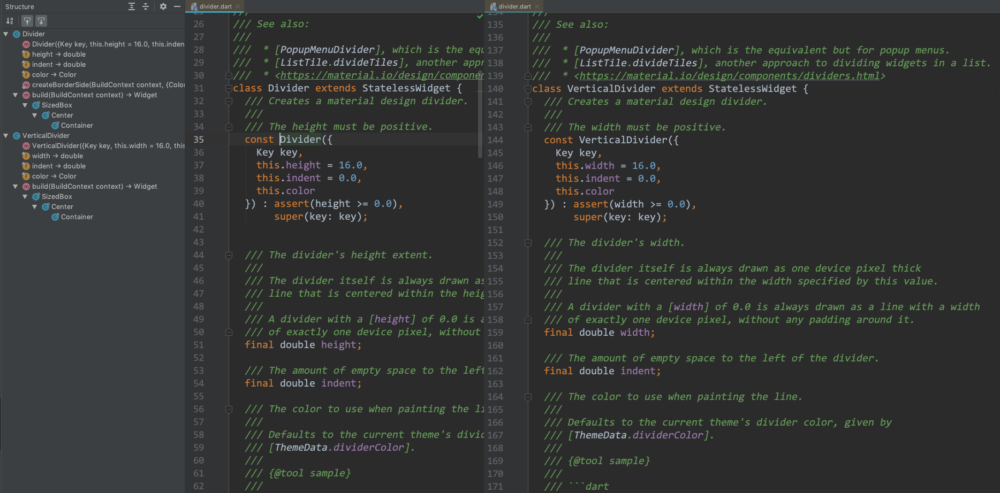

* ListView
* ListTile
* Divider & VerticalDivider

---

## 1. 概述

ListView 继承自 BoxScrollView`class ListView extends BoxScrollView`），常用的属性有 等。



## 2. 创建 ListView

创建 ListView

#### 2.1 方式一：使用 children 属性

```
@override
Widget build(BuildContext context) {
  return ListView(
    children: <Widget>[
      Text('Row One'),
      Text('Row Two'),
      Text('Row Three'),
      Text('Row Four'),
    ],
  );
}
```

该默认构造方法不能检测子参数的突变。

#### 方式二：使用 ListView.builder() 命名构造函数

提供了 ListView.builder() 命名构造函数，里面提供了 padding、itemBuilder 等属性和方法。

itemBuilder 是 `typedef IndexedWidgetBuilder = Widget Function(BuildContext context, int index);` 函数类型。

* ListView(children: ...) 通常用于数量固定的情况，如果要更新需要重新创建 `<Widget>[]`；
* ListView.builder(...) 相当于 Android 的 RecycleView，会自动回收 itme；

> 重点看看 https://flutter.dev/docs/get-started/flutter-for/android-devs#what-is-the-equivalent-of-okhttp-on-flutter 的 `How do I update ListView’s dynamically?` 小节，讲了这两种方法的区别，重点看看！！！

## ListTile

用于为 ListView 提供 itme 的布局，包括：title、subtitle、leading、trailing、enable、onTap、onLongPress 等属性和方法。

title、subtitle、leading、trailing 都是 Widget 类型。

onTap 是一个方法，方法签名为：`typedef GestureTapCallback = void Function();`

onLongPress是一个方法，方法签名为：`typedef GestureLongPressCallback = void Function();`
## Divider & VerticalDivider



#### 水平分割线：Divider

水平分割线 Divider 有一个 height 高度属性。

#### 竖直分割线：VerticalDivider

竖直分割线 VerticalDivider 有一个 width 宽度属性。
