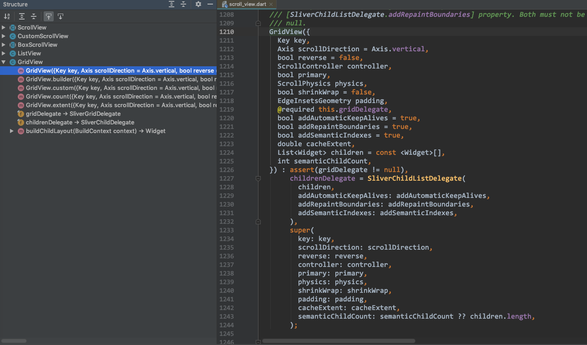

## 1. 概述

GridView 继承自 BoxScrollView`class GridView extends BoxScrollView`），常用的属性有 等。



## 2. xx

```
GridView.builder(
      gridDelegate: SliverGridDelegateWithFixedCrossAxisCount(
        crossAxisCount: 2,
      ),
      itemCount: photos.length,
      itemBuilder: (context, index) {
        return Image.network(photos[index].thumbnailUrl);
      },
);
```