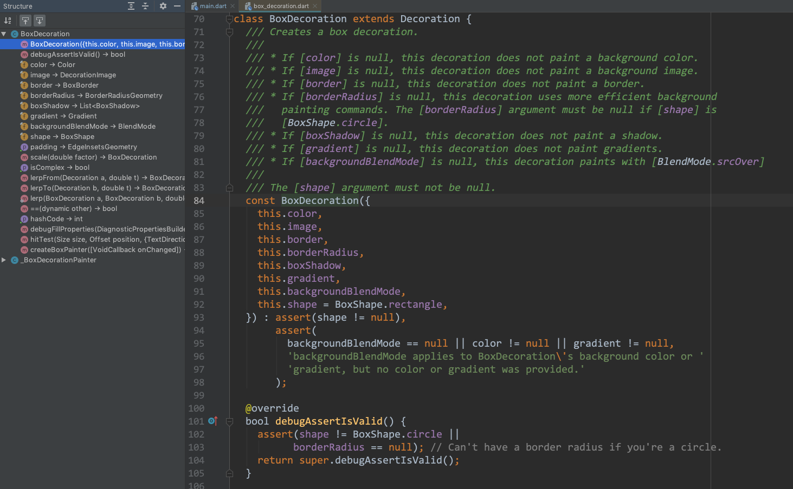
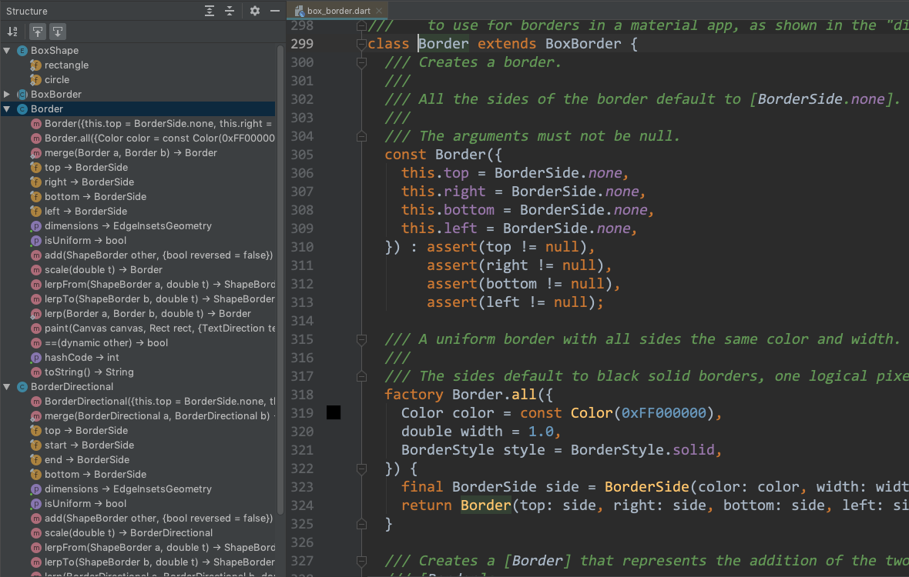

## BoxDecoration



可以指定背景色、背景图片、背景形状（矩形和圆形）、是否有边框、边框圆角的半径等。

## Border



## BoxShape

```
enum BoxShape {
    rectangle,
    circle,
}
```

---

## 使用示例

#### 圆角边框

```
Container(
    decoration: BoxDecoration(
        border: Border.all(color: Colors.grey),
        borderRadius: BorderRadius.circular(5.0),
    ),
    child: ListTile(
        title: Text(record.name),
        trailing: Text(record.votes.toString()),
        onTap: () => print(record.name),
    ),
),
```
