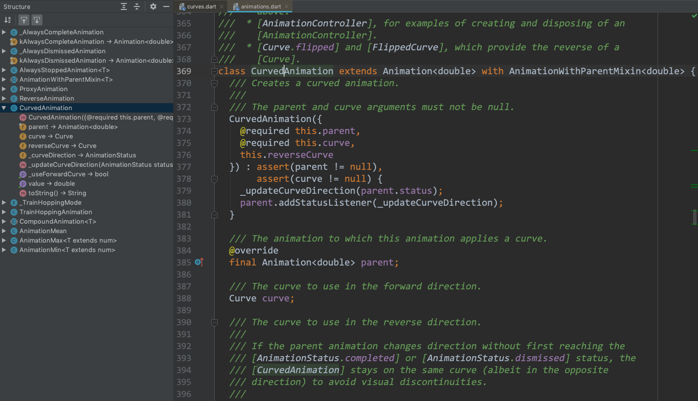
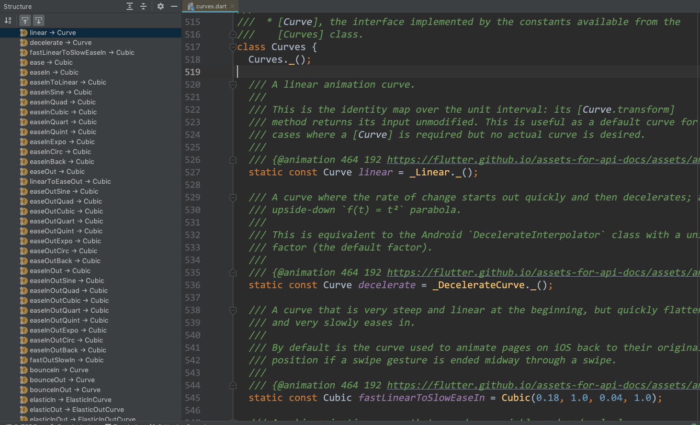

## CurvedAnimation



主要有 parent、curve、reverseCurve 3 个属性。

```
@override
final Animation<double> parent;

/// The curve to use in the forward direction.
Curve curve;

/// The curve to use in the reverse direction.
Curve reverseCurve;
```

parent 为控制该动画的 AnimationController；curve 和 reverseCurve 分别为正序播放动画和倒序播放动画的 Curve。

## Curves



常用的有 ease、easeIn、easeOut 等。
