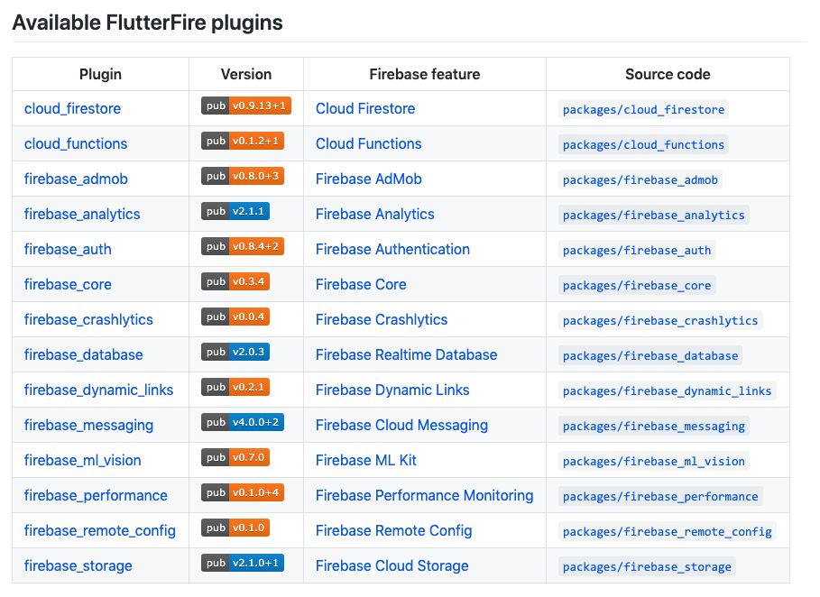

FlutterFire 由很多 Flutter Plugins 组成，使得 Flutter 应用程序可以使用一个或多个Firebase服务。

由如下这些 Flutter Plugins 组成:

---

* Firebase for Flutter Codelab ：https://codelabs.developers.google.com/codelabs/flutter-firebase