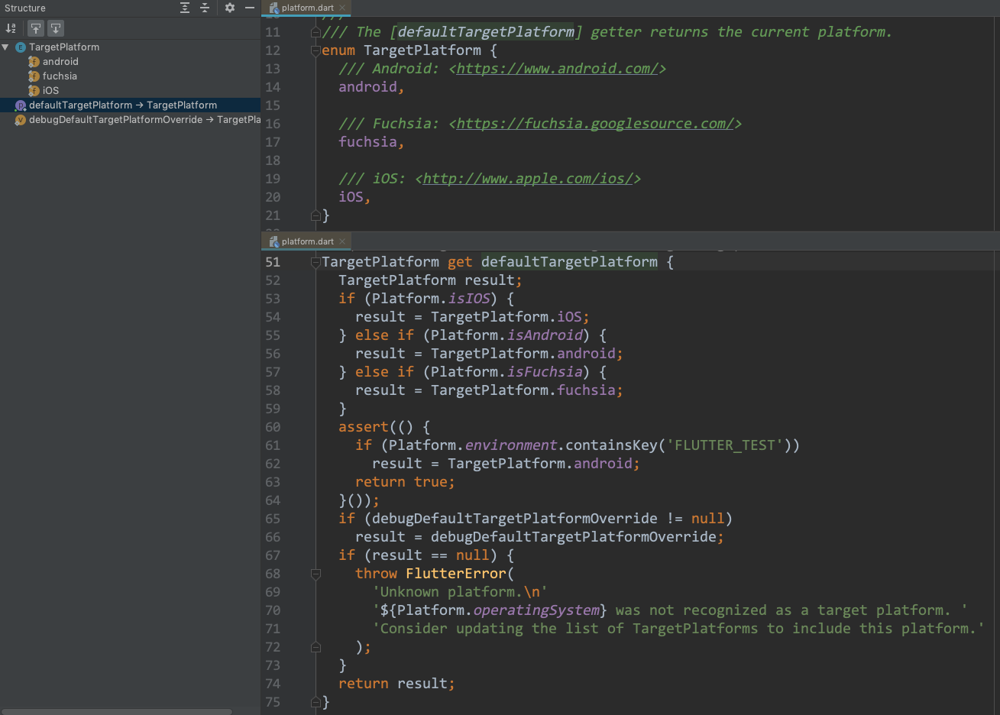

## TargetPlatform 枚举



```
enum TargetPlatform {
  /// Android: <https://www.android.com/>
  android,

  /// Fuchsia: <https://fuchsia.googlesource.com/>
  fuchsia,

  /// iOS: <http://www.apple.com/ios/>
  iOS,
}
```

## 获取当前的 TargetPlatform

* 顶级的 `defaultTargetPlatform` 属性

* `Theme.of(context).platform` 属性

#### defaultTargetPlatform 属性

```
TargetPlatform get defaultTargetPlatform {
  TargetPlatform result;
  if (Platform.isIOS) {
    result = TargetPlatform.iOS;
  } else if (Platform.isAndroid) {
    result = TargetPlatform.android;
  } else if (Platform.isFuchsia) {
    result = TargetPlatform.fuchsia;
  }
  assert(() {
    if (Platform.environment.containsKey('FLUTTER_TEST'))
      result = TargetPlatform.android;
    return true;
  }());
  if (debugDefaultTargetPlatformOverride != null)
    result = debugDefaultTargetPlatformOverride;
  if (result == null) {
    throw FlutterError(
      'Unknown platform.\n'
      '${Platform.operatingSystem} was not recognized as a target platform. '
      'Consider updating the list of TargetPlatforms to include this platform.'
    );
  }
  return result;
}
```