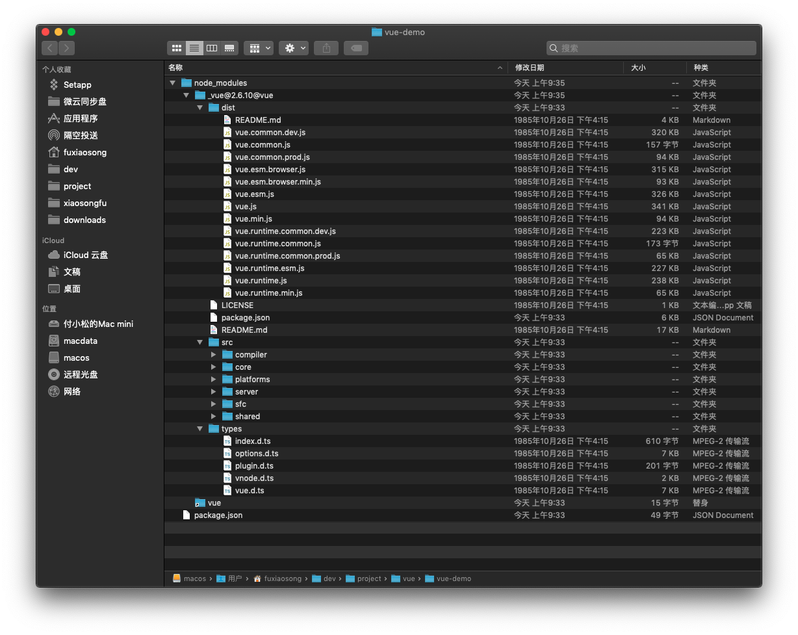
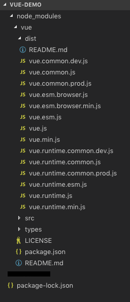
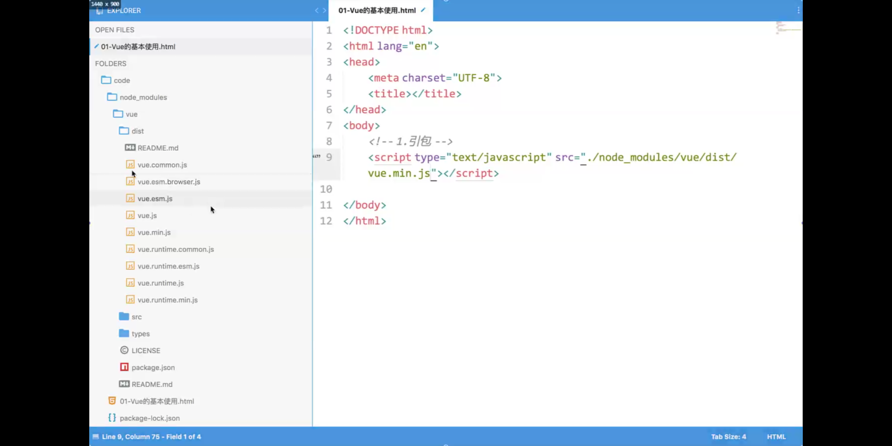

## 直接下载 vue.js 或者通过 CDN 引用


## 2. 通过 npm 下载 vue 到当前项目的 node_modules 目录

```
$ mkdir vue-demo

$ npm install -S vue
```

命令执行成功项目的结构如下：

这是低版本的：




这是高版本的：



新建 `index.html` 并引入 vue 即可开始开发了：

```
<body>
    <div id="app">
        <h1>{{ msg }}</h1>
    </div>

    <script type="text/javascript" src="./node_modules/vue/dist/vue.js"></script>
    <script>
        var v = new Vue({
            el: "#app",
            data: {
                msg: "hello"
            }
        });
    </script>
</body>
```


