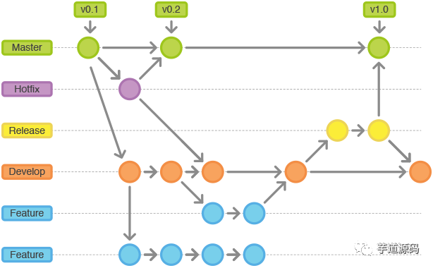

图文讲解，团队开发中的 Git 最佳实践: https://mp.weixin.qq.com/s/X8JbCBFPpt9aeev0RuEkIQ

Git工作流指南: https://github.com/xirong/my-git/blob/master/git-workflow-tutorial.md

---

有个很成熟的叫「Git Flow」的分支模型，它能够应对 99% 的场景。

简单说来，Git Flow 就是给原本普普通通的分支赋予了不同的「职责」：

* master  —— 最为稳定功能最为完整的随时可发布的代码；
* hotfix  —— 修复线上代码的 bug；
* develop —— 永远是功能最新最全的分支；
* feature —— 某个功能点正在开发阶段；
* release —— 发布定期要上线的功能。

master 和 develop 分支为主要分支，其他的分支是基于它们派生出来的。主要分支每种类型只能有一个，派生分支每个类型可以同时存在多个。

## 主分支开发-master

## 开发分支开发-develop

随时都保证是最新的代码。

## 功能分支开发-feature

负责对应功能开发的人基于 develop 分支创建一个 feature 分支并在其上进行开发工作。

功能开发完并自测之后，先切换到 develop 分支将最新的代码拉取下来，再切换回自己负责的 feature 分支把 develop 分支的代码合并进来,如果有冲突则自己和配合的人一起解决，最后将 feature 分支推送到远端，并在网页上提起一个 PR。

## 发布分支开发-release

负责测试的人基于 develop 分支创建一个 release 分支部署到测试环境进行测试；若发现了 bug，相应的开发人员就在 release 分支上或者基于 release 分支创建一个分支进行修复。

当确保某次发布的功能可以发布时，负责发布的人将 release 分支合并进 master 和 develop 并打上 tag，然后打包发布到线上环境。

## 修复分支开发-hotfix

负责修复 bug 的人基于 master 分支创建一个 hotfix 分支，测试修复成功后合并回 master 分支，并合并到 develop 分支。

