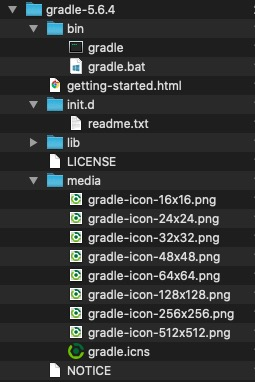

参考： https://gradle.org/install/

---

## 1. 下载软件包

可以下载完整的压缩包，或者只包含可执行文件的压缩包。完整的压缩包额外包含了源码和文档，我们这里下载只包含可执行文件的压缩包：

```
$ wget https://services.gradle.org/distributions/gradle-5.6.4-bin.zip
```

下载后解压，目录结构如下：



## 2. 配置环境变量

添加 GRADLE_HOME 环境变量，并将 GRADLE_HOME/bin 添加到系统 path 目录：

```
export GRADLE_HOME="/Users/fuxiaosong/dev/sdk/gradle-5.6.4"
export PATH=$PATH:$GRADLE_HOME/bin
```

## 3. 验证安装是否成功

```
$ gradle -v

------------------------------------------------------------
Gradle 5.6.4
------------------------------------------------------------

Build time:   2019-11-01 20:42:00 UTC
Revision:     dd870424f9bd8e195d614dc14bb140f43c22da98

Kotlin:       1.3.41
Groovy:       2.5.4
Ant:          Apache Ant(TM) version 1.9.14 compiled on March 12 2019
JVM:          1.8.0_74 (Oracle Corporation 25.74-b02)
OS:           Mac OS X 10.15.2 x86_64
```
