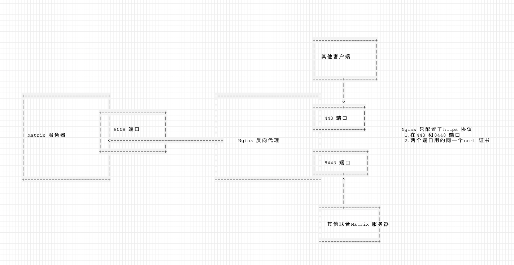
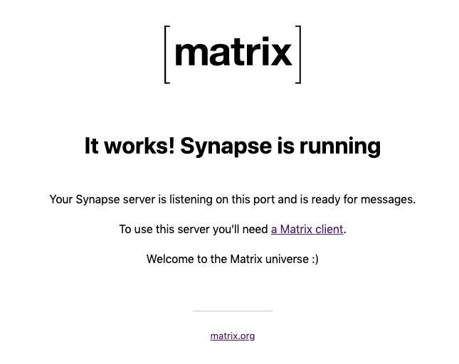

# 使用官方 docker 镜像安装

本文摘自如下两个文档，他们的内容是一样的：
* https://hub.docker.com/r/matrixdotorg/synapse/
* https://github.com/matrix-org/synapse/tree/master/docker

---

> 第三方的 docker：
* https://github.com/silvio/docker-matrix
* https://hub.docker.com/r/avhost/docker-matrix/tags

---

`enable_registration: true` : 启用客户端注册功能

`enable_registration_captcha: true` : 启用 Google 的“我不是机器人验证”

---

- 此 Docker 镜像将作为单个进程运行 Synapse。默认情况下，它使用 sqlite 数据库; 对于生产用途，您应该将其连接到单独的 postgres 数据库。
- 此 Docker 镜像也不提供 TURN 服务器。

## 1. 生成配置文件

第一步是生成有效的配置文件。为此，您可以使用 `generate` 命令行选项运行该镜像。

官方文档提示使用如下命令生成配置文件：

```
docker run -it --rm \
    --mount type=volume,src=synapse-data,dst=/data \
    -e SYNAPSE_SERVER_NAME=my.matrix.host \
    -e SYNAPSE_REPORT_STATS=yes \
    matrixdotorg/synapse:v1.3.1-py3 generate
```

我们需要将 server_name 修改为我们自己的域名，其他的保持不变：

```
docker run -it --rm \
    --mount type=volume,src=synapse-data,dst=/data \
    -e SYNAPSE_SERVER_NAME=im.fdev.ltd \
    -e SYNAPSE_REPORT_STATS=yes \
    matrixdotorg/synapse:v1.3.1-py3  generate
```

执行记录：

```
Creating log config /data/im.fdev.ltd.log.config
Generating config file /data/homeserver.yaml
Generating signing key file /data/im.fdev.ltd.signing.key
A config file has been generated in '/data/homeserver.yaml' for server name 'im.fdev.ltd'. Please review this file and customise it to your needs.
```

上面的命令在 `/var/lib/docker/volumes/synapse-data/_data` 目录生成了配置文件和密钥。

```
$ tree /var/lib/docker/volumes/synapse-data/
/var/lib/docker/volumes/synapse-data/
`-- _data
    |-- homeserver.yaml
    |-- im.fdev.ltd.log.config
    `-- im.fdev.ltd.signing.key

1 directory, 3 files
```

这些密钥将允许您的 homeserver 向其他 homeserver 标识自己，因此不要丢失或删除它们。把它们放在安全的地方是明智的。
（如果由于某种原因，您确实需要更改 homeserver 的密钥，您可能会发现其他 homeserver 已缓存旧密钥。如果更新签名密钥，请参阅规范。）

## 2. 运行 synapse

```
docker run -d --name synapse \
    --mount type=volume,src=synapse-data,dst=/data \
    -p 8008:8008 \
    matrixdotorg/synapse:v1.3.1-py3
```

只监听了 8008 一个端口。

## 3. TLS 配置

测试的时候可以直接使用 http 协议，但是生产环境使用建议使用 https 协议。

使用 https 协议有两种方式，一种是让 matrix 服务器监听 8448 端口，并为其配置 TLS 证书；另一种方式是为其配置反向代理，在反向代理处配置 TLS。这里讲一下 matrix 服务器监听 8448 端口的方式，配置反向代理的方式在下一节讲。

首先需要在配置文件中开启监听 8448 端口：

```
- port: 8448
    type: http
    tls: true
    resources:
      - names: [client, federation]
```

然后配置 TLS 证书信息：

```

```

## 4. 反向代理配置

建议在 Synapse 前放置一个反向代理，如 nginx，Apache，Caddy或HAProxy。这样做的一个优点是，这意味着您可以将默认的 https 端口（443）公开给 Matrix 客户端，而无需使用 root 权限运行 Synapse。

我们需要通过 nginx 配置在 443 和 8448 端口上进行 https 监听（不需要配置 http 监听），两个 server 配置使用同样的域名和 https 证书，只是端口不一样。最终需要实现官方的要求：

- Matrix 客户端默认使用 443 端口连接服务器，所以地址为：`https://matrix.example.com`
- 其他 Matrix 服务器则使用 8448 端口连接服务器，所以地址为：`https://matrix.example.com:8448`



nginx 配置文件如下，该配置文件参考 [nginx 官方的 https 配置文档](http://nginx.org/en/docs/http/configuring_https_servers.html)：

```
http{
    ssl_session_cache shared:SSL:10m;
    ssl_session_timeout 10m;

    server {
        listen 443 ssl;
        listen [::]:443 ssl;
        server_name im.fdev.ltd;
        keepalive_timeout 70;

        ssl_certificate     /etc/letsencrypt/live/im.fdev.ltd/fullchain.pem;
        ssl_certificate_key /etc/letsencrypt/live/im.fdev.ltd/privkey.pem;
        ssl_protocols       TLSv1 TLSv1.1 TLSv1.2;
        ssl_ciphers         HIGH:!aNULL:!MD5;

        location /_matrix {
            proxy_pass http://127.0.0.1:8008;
            proxy_set_header X-Forwarded-For $remote_addr;
        }
    }

    server {
        listen 8448 ssl default_server;
        listen [::]:8448 ssl default_server;
        server_name im.fdev.ltd;
        keepalive_timeout 70;

        ssl_certificate     /etc/letsencrypt/live/im.fdev.ltd/fullchain.pem;
        ssl_certificate_key /etc/letsencrypt/live/im.fdev.ltd/privkey.pem;
        ssl_protocols       TLSv1 TLSv1.1 TLSv1.2;
        ssl_ciphers         HIGH:!aNULL:!MD5;

        location / {
            proxy_pass http://127.0.0.1:8008;
            proxy_set_header X-Forwarded-For $remote_addr;
        }
    }
}
```

配置了两个相同域名的 server ，分别在 443 和 8448 端口上监听 https 请求，他们使用同一份 https 证书。

最后使用浏览器访问 `https://im.fdev.ltd/_matrix/static/` 看 matrix 服务是否正常启动以及 TLS 和反向代理是否配置成功：


