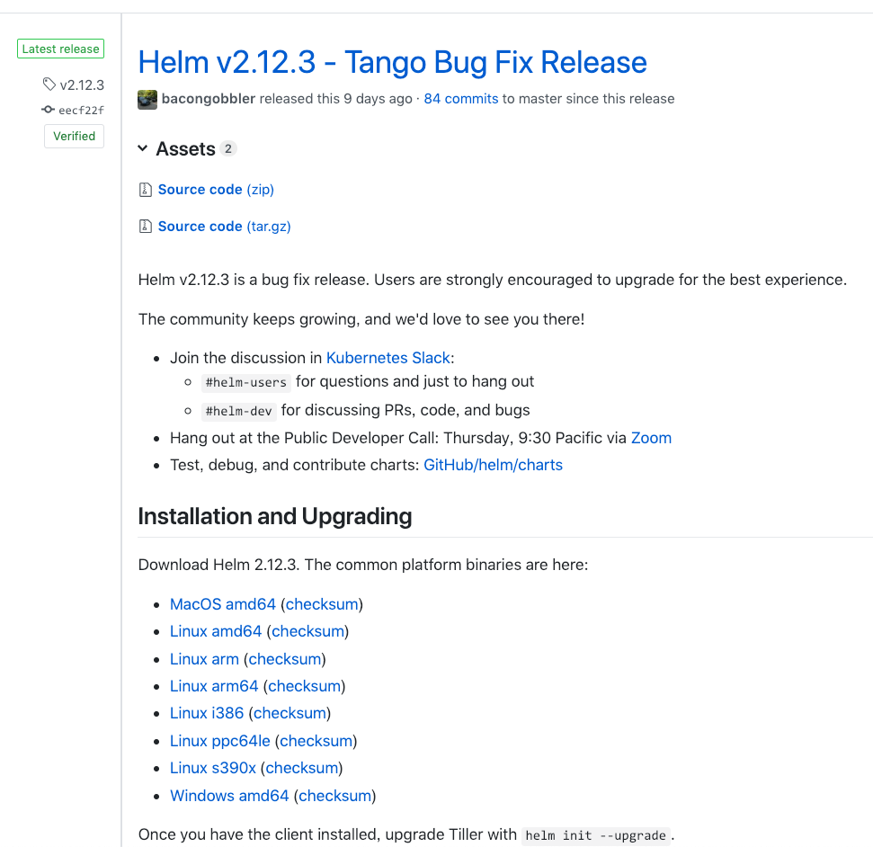

1. 安装
    1.1 开始安装
    1.2 查看安装结果
2. 安装一个 Chart 示例

----

# 1. 安装


Helm 可以理解为 Kubernetes 的包管理工具，可以方便地发现、共享和使用为Kubernetes构建的应用，它包含几个基本概念
* Chart：一个 Helm 包，其中包含了运行一个应用所需要的镜像、依赖和资源定义等，还可能包含 Kubernetes 集群中的服务定义
* Release: 在 Kubernetes 集群上运行的 Chart 的一个实例。在同一个集群上，一个 Chart 可以安装很多次。每次安装都会创建一个新的 release。例如一个 MySQL Chart，如果想在服务器上运行两个数据库，就可以把这个 Chart 安装两次。每次安装都会生成自己的 Release，会有自己的 Release 名称。
* Repository：用于发布和存储 Chart 的仓库。

Helm 采用客户端/服务器架构，有如下组件组成：
* Helm CLI 是 Helm 客户端，可以在本地执行
* Tiller 是服务器端组件，在 Kubernetes 群集上运行，并管理 Kubernetes 应用程序的生命周期
* Repository 是 Chart 仓库，Helm客户端通过HTTP协议来访问仓库中Chart的索引文件和压缩包。

## 1.1 开始安装

Helm will figure out where to install Tiller by reading your Kubernetes configuration file (usually `$HOME/.kube/config`). This is the same file that `kubectl` uses.



从 helm Github 仓库的 release 页面下载 helm 压缩包，解压，然后将 helm 可执行文件复制到 `/usr/local/bin/` 目录（Linux 和 macOS），或者将其目录添加到环境变量（Windows）。

接着执行 `helm init` 命令进行初始化。helm 会在 Kubernetes 的 kube-system 命名空间中启动一个 Tiller 容器，Tiller 负责接收 helm 命令，并对 Kubernetes 集群进行操作：

```
# 下载 v2.12.3 2019年02月01日15:21:53
wget https://storage.googleapis.com/kubernetes-helm/helm-v2.12.3-linux-amd64.tar.gz

tar -zxvf helm-v2.12.3-linux-amd64.tar.gz

cp linux-amd64/helm /usr/local/bin/

helm init
```

`helm init` 命令有两个有用的 flag：
* `--upgrade`            --> (用来升级 helm) upgrade if Tiller is already installed
* `--tiller-image string` --> (指定替代的 docker image) override Tiller image

默认使用的 docker images 为 `gcr.io` 仓库里的，如 `gcr.io/kubernetes-helm/tiller:v2.8.1`，国内访问不了，这里我们使用 aliyun 提供的，使用如下命令安装：

```
helm init --tiller-image registry.cn-hangzhou.aliyuncs.com/google_containers/tiller:v2.12.3
```

命令执行记录如下：

```
[root@dockerapp ~]# helm version
Client: &version.Version{SemVer:"v2.12.3", GitCommit:"eecf22f77df5f65c823aacd2dbd30ae6c65f186e", GitTreeState:"clean"}
Error: could not find tiller

[root@dockerapp ~]# helm init --tiller-image registry.cn-hangzhou.aliyuncs.com/google_containers/tiller:v2.12.3
Creating /root/.helm
Creating /root/.helm/repository
Creating /root/.helm/repository/cache
Creating /root/.helm/repository/local
Creating /root/.helm/plugins
Creating /root/.helm/starters
Creating /root/.helm/cache/archive
Creating /root/.helm/repository/repositories.yaml
Adding stable repo with URL: https://kubernetes-charts.storage.googleapis.com
Adding local repo with URL: http://127.0.0.1:8879/charts
$HELM_HOME has been configured at /root/.helm.

Tiller (the Helm server-side component) has been installed into your Kubernetes Cluster.

Please note: by default, Tiller is deployed with an insecure 'allow unauthenticated users' policy.
To prevent this, run `helm init` with the --tiller-tls-verify flag.
For more information on securing your installation see: https://docs.helm.sh/using_helm/#securing-your-helm-installation
Happy Helming!
[root@dockerapp ~]#
```

> 注意有一行输出：`Adding stable repo with URL: https://kubernetes-charts.storage.googleapis.com`，这个 repo 地址是官方的 `stable` 仓库地址，`incubator` 仓库地址是 `xxx`。

> 官方的 `stable` 仓库地址可能访问不到，可以使用 aliyun 提供的：

```
helm init --service-account tiller --tiller-image registry.cn-hangzhou.aliyuncs.com/google_containers/tiller:v2.12.3 --stable-repo-url https://kubernetes.oss-cn-hangzhou.aliyuncs.com/charts
```

> tiller pod 一直启动不起来，使用 `kubectl --namespace=kube-system set image deployments/tiller-deploy tiller=docker.io/jessestuart/tiller:v2.12.3` 更新 image 试试。

helm 命令需要与 Tiller 容器进行通信，因此本地必须安装 socat 进行端口转发：

```
yum -y install socat
```

---

另外一个值得注意的问题是 RBAC，我们的 kubernetes 集群默认开启了 RBAC 访问控制，所以我们需要为 Tiller 创建一个 ServiceAccount，让他拥有执行的权限。

https://github.com/helm/helm/blob/master/docs/rbac.md

```
apiVersion: v1
kind: ServiceAccount
metadata:
  name: tiller
  namespace: kube-system
---
apiVersion: rbac.authorization.k8s.io/v1
kind: ClusterRoleBinding
metadata:
  name: tiller
roleRef:
  apiGroup: rbac.authorization.k8s.io
  kind: ClusterRole
  name: cluster-admin
subjects:
  - kind: ServiceAccount
    name: tiller
    namespace: kube-system
```

```
$ kubectl create -f rbac-config.yaml
serviceaccount "tiller" created
clusterrolebinding "tiller" created
```

```
$ helm init --service-account tiller --tiller-image registry.cn-hangzhou.aliyuncs.com/google_containers/tiller:v2.12.3
```

---

## 1.2 查看安装结果

> kubectl get deployments -n kube-system

```
[root@dockerapp ~]# kubectl get deployments -n kube-system
NAME            READY   UP-TO-DATE   AVAILABLE   AGE
coredns         2/2     2            2           25d
tiller-deploy   0/1     1            0           10d
[root@dockerapp ~]#
```

> kubectl get pods -n kube-system

```
[root@dockerapp ~]# kubectl get pods -n kube-system
NAME                                READY   STATUS             RESTARTS   AGE
tiller-deploy-857894d5c7-5zp2x      0/1     CrashLoopBackOff   6          8m31s
```

> kubectl describe deployments tiller-deploy -n kube-system

```
[root@dockerapp ~]# kubectl describe deployments tiller-deploy -n kube-system
Name:                   tiller-deploy
Namespace:              kube-system
CreationTimestamp:      Fri, 01 Feb 2019 16:00:03 +0800
Labels:                 app=helm
                        name=tiller
Annotations:            deployment.kubernetes.io/revision: 1
Selector:               app=helm,name=tiller
Replicas:               1 desired | 1 updated | 1 total | 0 available | 1 unavailable
StrategyType:           RollingUpdate
MinReadySeconds:        0
RollingUpdateStrategy:  1 max unavailable, 1 max surge
Pod Template:
  Labels:  app=helm
           name=tiller
  Containers:
   tiller:
    Image:       docker.io/jessestuart/tiller:v2.12.3
    Ports:       44134/TCP, 44135/TCP
    Host Ports:  0/TCP, 0/TCP
    Liveness:    http-get http://:44135/liveness delay=1s timeout=1s period=10s #success=1 #failure=3
    Readiness:   http-get http://:44135/readiness delay=1s timeout=1s period=10s #success=1 #failure=3
    Environment:
      TILLER_NAMESPACE:    kube-system
      TILLER_HISTORY_MAX:  0
    Mounts:                <none>
  Volumes:                 <none>
Conditions:
  Type           Status  Reason
  ----           ------  ------
  Available      True    MinimumReplicasAvailable
OldReplicaSets:  <none>
NewReplicaSet:   tiller-deploy-857894d5c7 (1/1 replicas created)
Events:
  Type    Reason             Age   From                   Message
  ----    ------             ----  ----                   -------
  Normal  ScalingReplicaSet  4m5s  deployment-controller  Scaled up replica set tiller-deploy-857894d5c7 to 1
[root@dockerapp ~]#
```

> kubectl describe replicaset tiller-deploy-857894d5c7 -n kube-system

```
[root@dockerapp ~]# kubectl describe replicaset tiller-deploy-857894d5c7 -n kube-system
Name:           tiller-deploy-857894d5c7
Namespace:      kube-system
Selector:       app=helm,name=tiller,pod-template-hash=857894d5c7
Labels:         app=helm
                name=tiller
                pod-template-hash=857894d5c7
Annotations:    deployment.kubernetes.io/desired-replicas: 1
                deployment.kubernetes.io/max-replicas: 2
                deployment.kubernetes.io/revision: 1
Controlled By:  Deployment/tiller-deploy
Replicas:       1 current / 1 desired
Pods Status:    1 Running / 0 Waiting / 0 Succeeded / 0 Failed
Pod Template:
  Labels:  app=helm
           name=tiller
           pod-template-hash=857894d5c7
  Containers:
   tiller:
    Image:       docker.io/jessestuart/tiller:v2.12.3
    Ports:       44134/TCP, 44135/TCP
    Host Ports:  0/TCP, 0/TCP
    Liveness:    http-get http://:44135/liveness delay=1s timeout=1s period=10s #success=1 #failure=3
    Readiness:   http-get http://:44135/readiness delay=1s timeout=1s period=10s #success=1 #failure=3
    Environment:
      TILLER_NAMESPACE:    kube-system
      TILLER_HISTORY_MAX:  0
    Mounts:                <none>
  Volumes:                 <none>
Events:
  Type    Reason            Age    From                   Message
  ----    ------            ----   ----                   -------
  Normal  SuccessfulCreate  5m35s  replicaset-controller  Created pod: tiller-deploy-857894d5c7-5zp2x
[root@dockerapp ~]#
```

> kubectl describe pod tiller-deploy-857894d5c7-5zp2x -n kube-system

```
[root@dockerapp ~]# kubectl describe pod tiller-deploy-857894d5c7-5zp2x -n kube-system
Name:               tiller-deploy-857894d5c7-5zp2x
Namespace:          kube-system
Priority:           0
PriorityClassName:  <none>
Node:               qgw-live/192.168.160.5
Start Time:         Fri, 01 Feb 2019 16:00:04 +0800
Labels:             app=helm
                    name=tiller
                    pod-template-hash=857894d5c7
Annotations:        <none>
Status:             Running
IP:                 10.244.1.16
Controlled By:      ReplicaSet/tiller-deploy-857894d5c7
Containers:
  tiller:
    Container ID:   docker://554a324f9aaabe4419e9705cbb9faf6b145aa51a111d6b8813583014ef472429
    Image:          docker.io/jessestuart/tiller:v2.12.3
    Image ID:       docker-pullable://jessestuart/tiller@sha256:ae40455a068c8ae297ab95cb1d7eecb4b59cb360a1ea24fe0d23ba37eb7e5cd4
    Ports:          44134/TCP, 44135/TCP
    Host Ports:     0/TCP, 0/TCP
    State:          Waiting
      Reason:       CrashLoopBackOff
    Last State:     Terminated
      Reason:       Error
      Exit Code:    1
      Started:      Fri, 01 Feb 2019 16:05:52 +0800
      Finished:     Fri, 01 Feb 2019 16:05:52 +0800
    Ready:          False
    Restart Count:  6
    Liveness:       http-get http://:44135/liveness delay=1s timeout=1s period=10s #success=1 #failure=3
    Readiness:      http-get http://:44135/readiness delay=1s timeout=1s period=10s #success=1 #failure=3
    Environment:
      TILLER_NAMESPACE:    kube-system
      TILLER_HISTORY_MAX:  0
    Mounts:
      /var/run/secrets/kubernetes.io/serviceaccount from default-token-xn42n (ro)
Conditions:
  Type              Status
  Initialized       True
  Ready             False
  ContainersReady   False
  PodScheduled      True
Volumes:
  default-token-xn42n:
    Type:        Secret (a volume populated by a Secret)
    SecretName:  default-token-xn42n
    Optional:    false
QoS Class:       BestEffort
Node-Selectors:  <none>
Tolerations:     node.kubernetes.io/not-ready:NoExecute for 300s
                 node.kubernetes.io/unreachable:NoExecute for 300s
Events:
  Type     Reason     Age                    From               Message
  ----     ------     ----                   ----               -------
  Normal   Scheduled  6m32s                  default-scheduler  Successfully assigned kube-system/tiller-deploy-857894d5c7-5zp2x to qgw-live
  Normal   Pulling    6m31s                  kubelet, qgw-live  pulling image "docker.io/jessestuart/tiller:v2.12.3"
  Normal   Pulled     6m21s                  kubelet, qgw-live  Successfully pulled image "docker.io/jessestuart/tiller:v2.12.3"
  Normal   Pulled     4m58s (x4 over 6m19s)  kubelet, qgw-live  Container image "docker.io/jessestuart/tiller:v2.12.3" already present on machine
  Normal   Created    4m57s (x5 over 6m20s)  kubelet, qgw-live  Created container
  Normal   Started    4m57s (x5 over 6m20s)  kubelet, qgw-live  Started container
  Warning  BackOff    87s (x27 over 6m18s)   kubelet, qgw-live  Back-off restarting failed container
[root@dockerapp ~]#
```

## 1.3 卸载 helm

由于 Tiller 将其数据存储在 Kubernetes ConfigMaps 中，因此您可以安全地删除并重新安装 Tiller，而无需担心丢失任何数据。

删除 Tiller 的推荐方法是使用 `kubectl delete deployment tiller-deploy --namespace kube-system`，或者更简洁的 `helm reset`。然后可以从客户端重新安装Tiller：

```
$ helm init
```

# 2. 安装一个 Chart 示例

## 2.1 安装

要安装 Chart，可以运行 `helm install` 命令。Helm 有几种查找和安装 Chart 的方法，但最简单的方法是使用官方的 `stable charts`。

```
$ helm repo update # Make sure we get the latest list of charts
$ helm install stable/mysql
NAME:   wintering-rodent
LAST DEPLOYED: Thu Oct 18 14:21:18 2018
NAMESPACE: default
STATUS: DEPLOYED

......

```

在上面的例子中，发布了 `stable/mysql` 图表，我们的新 release 的名称是 wintering-rodent。通过运行 `helm inspect stable/mysql`，您可以简单了解此 MySQL Chart 的功能。

每当您安装 Chart 时，都会创建一个新 release。因此，可以将多个 Chart 多次安装到同一个集群中。每个都可以独立管理和升级。

使用 `helm list` 查看所有 release：

```
$ helm list
NAME            	REVISION	UPDATED                 	STATUS  	CHART       	APP VERSION	NAMESPACE
wintering-rodent	1       	Thu Oct 18 15:06:58 2018	DEPLOYED	mysql-0.10.1	5.7.14     	default
```

## 2.2 卸载

使用 `helm delete` 命令卸载：

```
$ helm delete wintering-rodent
release "wintering-rodent" deleted
```

这将从 Kubernetes 中卸载 wintering-rodent，但您仍然可以请求有关该 release 的信息：

```
$ helm status wintering-rodent
LAST DEPLOYED: Thu Oct 18 14:21:18 2018
NAMESPACE: default
STATUS: DELETED

......

```

因为 Helm 甚至在您删除它们之后也跟踪它们，所以您可以审核集群的历史记录，甚至取消删除一个 release（使用 `helm rollback`）。

---

```
[root@dockerapp ~]# helm init -h

This command installs Tiller (the Helm server-side component) onto your
Kubernetes Cluster and sets up local configuration in $HELM_HOME (default ~/.helm/).

As with the rest of the Helm commands, 'helm init' discovers Kubernetes clusters
by reading $KUBECONFIG (default '~/.kube/config') and using the default context.

To set up just a local environment, use '--client-only'. That will configure
$HELM_HOME, but not attempt to connect to a Kubernetes cluster and install the Tiller
deployment.

When installing Tiller, 'helm init' will attempt to install the latest released
version. You can specify an alternative image with '--tiller-image'. For those
frequently working on the latest code, the flag '--canary-image' will install
the latest pre-release version of Tiller (e.g. the HEAD commit in the GitHub
repository on the master branch).

To dump a manifest containing the Tiller deployment YAML, combine the
'--dry-run' and '--debug' flags.

Usage:
  helm init [flags]

Flags:
      --automount-service-account-token   auto-mount the given service account to tiller (default true)
      --canary-image                      use the canary Tiller image
  -c, --client-only                       if set does not install Tiller
      --dry-run                           do not install local or remote
      --force-upgrade                     force upgrade of Tiller to the current helm version
  -h, --help                              help for init
      --history-max int                   limit the maximum number of revisions saved per release. Use 0 for no limit.
      --local-repo-url string             URL for local repository (default "http://127.0.0.1:8879/charts")
      --net-host                          install Tiller with net=host
      --node-selectors string             labels to specify the node on which Tiller is installed (app=tiller,helm=rocks)
  -o, --output OutputFormat               skip installation and output Tiller's manifest in specified format (json or yaml)
      --override stringArray              override values for the Tiller Deployment manifest (can specify multiple or separate values with commas: key1=val1,key2=val2)
      --replicas int                      amount of tiller instances to run on the cluster (default 1)
      --service-account string            name of service account
      --skip-refresh                      do not refresh (download) the local repository cache
      --stable-repo-url string            URL for stable repository (default "https://kubernetes-charts.storage.googleapis.com")
  -i, --tiller-image string               override Tiller image
      --tiller-tls                        install Tiller with TLS enabled
      --tiller-tls-cert string            path to TLS certificate file to install with Tiller
      --tiller-tls-hostname string        the server name used to verify the hostname on the returned certificates from Tiller
      --tiller-tls-key string             path to TLS key file to install with Tiller
      --tiller-tls-verify                 install Tiller with TLS enabled and to verify remote certificates
      --tls-ca-cert string                path to CA root certificate
      --upgrade                           upgrade if Tiller is already installed
      --wait                              block until Tiller is running and ready to receive requests

Global Flags:
      --debug                           enable verbose output
      --home string                     location of your Helm config. Overrides $HELM_HOME (default "/root/.helm")
      --host string                     address of Tiller. Overrides $HELM_HOST
      --kube-context string             name of the kubeconfig context to use
      --kubeconfig string               absolute path to the kubeconfig file to use
      --tiller-connection-timeout int   the duration (in seconds) Helm will wait to establish a connection to tiller (default 300)
      --tiller-namespace string         namespace of Tiller (default "kube-system")
[root@dockerapp ~]#
```
