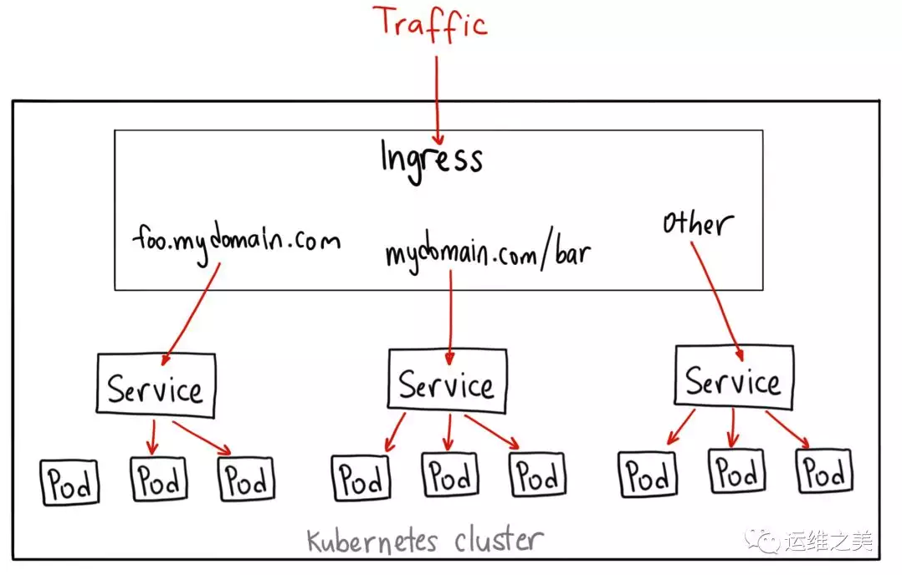

## 1. ingress 简介



Ingress 是自 Kubernetes 1.1 版本后引入的资源类型。Ingress 支持将 Service 暴露到 Kubernetes 集群外，同时可以自定义 Service 的访问策略。Ingress 能够把 Service 配置成外网能够访问的 URL，也支持提供按域名访问的虚拟主机功能。例如，通过负载均衡器实现不同的二级域名到不同 Service 的访问。

实际上 Ingress 只是一个统称，其由 Ingress 和 Ingress Controller 两部分组成。Ingress 用作将原来需要手动配置的规则抽象成一个 Ingress 对象，使用 YAML 格式的文件来创建和管理。Ingress Controller 用作通过与 Kubernetes API 交互，动态的去感知集群中 Ingress 规则变化。

使用 Ingress 前必须要先部署 Ingress Controller，Ingress Controller 是以一种插件的形式提供。Ingress Controller 通常是部署在 Kubernetes 之上的 Docker 容器，Ingress Controller 的 Docker 镜像里包含一个像 Nginx 或 HAProxy 的负载均衡器和一个 Ingress Controller。Ingress Controller 会从 Kubernetes 接收所需的 Ingress 配置，然后动态生成一个 Nginx 或 HAProxy 配置文件，并重新启动负载均衡器进程以使更改生效。换句话说，Ingress Controller 是由 Kubernetes 管理的负载均衡器。

> 注：无论使用何种负载均衡软件（ 比如：Nginx、HAProxy、Traefik等）来实现 Ingress Controller，官方都将其统称为 Ingress Controller。

---

A minimal ingress resource example:

```
apiVersion: extensions/v1beta1
kind: Ingress
metadata:
  name: test-ingress
  annotations:
    nginx.ingress.kubernetes.io/rewrite-target: /
spec:
  rules:
  - http:
      paths:
      - path: /testpath
        backend:
          serviceName: test
          servicePort: 80
```


```
apiVersion: extensions/v1beta1
kind: Ingress
metadata:
  name: name-virtual-host-ingress
spec:
  rules:
  - host: foo.bar.com
    http:
      paths:
      - backend:
          serviceName: service1
          servicePort: 80
  - host: bar.foo.com
    http:
      paths:
      - backend:
          serviceName: service2
          servicePort: 80
```

```
apiVersion: extensions/v1beta1
kind: Ingress
metadata:
  name: test
  annotations:
    ingress.kubernetes.io/rewrite-target: /
spec:
  rules:
  - host: foo.bar.com
    http:
      paths:
      - path: /foo
        backend:
          serviceName: s1
          servicePort: 80
      - path: /bar
        backend:
          serviceName: s2
          servicePort: 80
```

---

## 我的安装记录

```
[root@dockerapp ingress-test]# kubectl get ingresses
NAME                   HOSTS   ADDRESS   PORTS   AGE
ingress-test-ingress   *                 80      21h

[root@dockerapp ingress-test]# kubectl describe ingress ingress-test-ingress
Name:             ingress-test-ingress
Namespace:        default
Address:
Default backend:  default-http-backend:80 (<none>)
Rules:
  Host  Path  Backends
  ----  ----  --------
  *
        /ingress-test   ingress-test-service:80 (<none>)
Annotations:
  kubectl.kubernetes.io/last-applied-configuration:  {"apiVersion":"extensions/v1beta1","kind":"Ingress","metadata":{"annotations":{},"name":"ingress-test-ingress","namespace":"default"},"spec":{"rules":[{"http":{"paths":[{"backend":{"serviceName":"ingress-test-service","servicePort":80},"path":"/ingress-test"}]}}]}}

Events:  <none>
```


```
[root@dockerapp GZPowerExchangeCenterAppDev]# kubectl get ingresses
NAME                   HOSTS   ADDRESS   PORTS   AGE
gzpower-docs-ingress   *                 80      2m12s
ingress-test-ingress   *                 80      21h

[root@dockerapp GZPowerExchangeCenterAppDev]# kubectl describe ingress gzpower-docs-ingress
Name:             gzpower-docs-ingress
Namespace:        default
Address:
Default backend:  default-http-backend:80 (<none>)
Rules:
  Host  Path  Backends
  ----  ----  --------
  *
        /gzpower-docs   gzpower-docs-service:80 (<none>)
Annotations:
  kubectl.kubernetes.io/last-applied-configuration:  {"apiVersion":"extensions/v1beta1","kind":"Ingress","metadata":{"annotations":{},"name":"gzpower-docs-ingress","namespace":"default"},"spec":{"rules":[{"http":{"paths":[{"backend":{"serviceName":"gzpower-docs-service","servicePort":80},"path":"/gzpower-docs"}]}}]}}

Events:
  Type    Reason  Age    From                      Message
  ----    ------  ----   ----                      -------
  Normal  CREATE  2m32s  nginx-ingress-controller  Ingress default/gzpower-docs-ingress
```