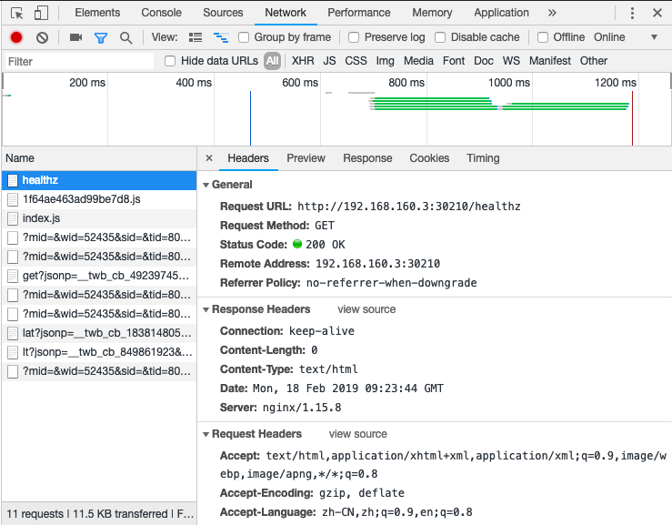
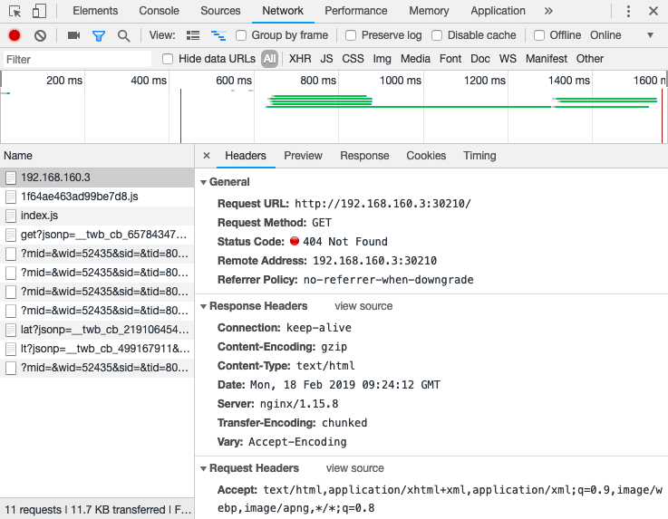

参考官方文档：https://kubernetes.github.io/ingress-nginx/deploy/

## 1. 安装 ingress-nginx

### 1.1 使用 yaml 配置文件安装

不管是在 cloud provider 上还是裸机上部署 ingress-nginx，都需要先部署这个：

```
kubectl apply -f https://raw.githubusercontent.com/kubernetes/ingress-nginx/master/deploy/mandatory.yaml
```

##### 1.1.1 在 Docker for Mac

```
kubectl apply -f https://raw.githubusercontent.com/kubernetes/ingress-nginx/master/deploy/provider/cloud-generic.yaml
```

##### 1.1.2 GCE - GKE

```
kubectl apply -f https://raw.githubusercontent.com/kubernetes/ingress-nginx/master/deploy/provider/cloud-generic.yaml
```

##### 1.1.3 Azure

```
kubectl apply -f https://raw.githubusercontent.com/kubernetes/ingress-nginx/master/deploy/provider/cloud-generic.yaml
```

##### 1.1.4 Bare-metal（裸机）

注：一般在自建的 Kubernetes 集群上都没有 LoadBalance 功能，所以都是使用 NodePort。

使用 NodePort:

```
kubectl apply -f https://raw.githubusercontent.com/kubernetes/ingress-nginx/master/deploy/provider/baremetal/service-nodeport.yaml
```

### 1.2 使用 helm 安装

可以使用官方 chart 仓库的 `stable/nginx-ingress` 来安装 NGINX Ingress。

如果集群启用了 RBAC，需要设置 `--set rbac.create=true` :

```
helm install stable/nginx-ingress --name my-nginx-ingress --set rbac.create=true
```

---

我的安装： helm 不能翻墙而失败，选择安装 yaml 文件。

```
[root@dockerapp ~]# helm install stable/nginx-ingress --name nginx-ingress --set rbac.create=true
Error: failed to download "stable/nginx-ingress" (hint: running `helm repo update` may help)

[root@dockerapp ~]# kubectl apply -f https://raw.githubusercontent.com/kubernetes/ingress-nginx/master/deploy/mandatory.yaml
namespace/ingress-nginx created
configmap/nginx-configuration created
configmap/tcp-services created
configmap/udp-services created
serviceaccount/nginx-ingress-serviceaccount created
clusterrole.rbac.authorization.k8s.io/nginx-ingress-clusterrole created
role.rbac.authorization.k8s.io/nginx-ingress-role created
rolebinding.rbac.authorization.k8s.io/nginx-ingress-role-nisa-binding created
clusterrolebinding.rbac.authorization.k8s.io/nginx-ingress-clusterrole-nisa-binding created
deployment.apps/nginx-ingress-controller created

[root@dockerapp ~]# kubectl apply -f https://raw.githubusercontent.com/kubernetes/ingress-nginx/master/deploy/provider/baremetal/service-nodeport.yaml
service/ingress-nginx created
[root@dockerapp ~]#
```

都是安装在 ingress-nginx 命名空间下的。

```
[root@dockerapp ~]# kubectl get deployments -n ingress-nginx
NAME                       READY   UP-TO-DATE   AVAILABLE   AGE
nginx-ingress-controller   0/1     1            0           6m46s

[root@dockerapp ~]# kubectl get services -n ingress-nginx
NAME            TYPE       CLUSTER-IP     EXTERNAL-IP   PORT(S)                      AGE
ingress-nginx   NodePort   10.111.90.39   <none>        80:30210/TCP,443:32641/TCP   6m30s

[root@dockerapp ~]# kubectl get pods -n ingress-nginx
NAME                                        READY   STATUS             RESTARTS   AGE
nginx-ingress-controller-68db76b4db-w7h7x   0/1     ImagePullBackOff   0          7m1s
```

---

### 1.3 验证安装

使用以下命令查看 ingress controller 的 pod 是否都已经启动了：

```
kubectl get pods --all-namespaces -l app.kubernetes.io/name=ingress-nginx --watch
```

当这些 pod 都是 running 的时候，就表示安装成功了。使用 `ctrl+c` 退出。

### 1.4 查看安装的版本

要查看正在运行的 ingress controller 的版本号，通过进入 pod 并执行 `nginx-ingress-controller --version` 命令来实现：

```
POD_NAME=$(kubectl get pods -l app.kubernetes.io/name=ingress-nginx -o jsonpath='{.items[0].metadata.name}')
kubectl exec -it $POD_NAME -- /nginx-ingress-controller --version
```

## 2. Default backend

默认后端是一个服务，它处理 nginx 控制器无法理解的所有 URL 路径和主机（即，ingress 里面没有配置的所有请求）。

简单的，默认后端暴露了2个 URL：

* `/healthz`： that returns 200
* `/`： that returns 404





## 3. 升级 ingress-nginx

使用 helm 安装，安装名称为：my-nginx-ingress 

```
$ helm upgrade --reuse-values my-nginx-ingress stable/nginx-ingress
```

---

参考：

* [利用 Helm 快速部署 Ingress](https://mp.weixin.qq.com/s/0iKlG1ihSd9ceCK_aJyRbw)
* [浅析从外部访问 Kubernetes 集群中应用的几种方式](https://mp.weixin.qq.com/s/jynmVN3xXnZrAxM_gN8ohQ)