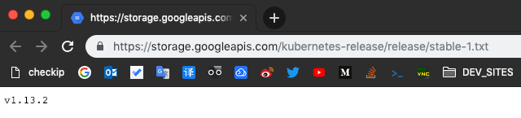
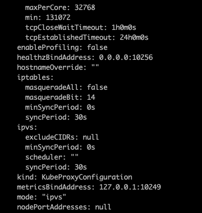

# 使用 kubeadm 安装

> 第一版可以参考：[Centos 7 使用 kubeadm 安装 Kubernetes 集群]()

> 这一版是 2019年01月17日 安装 v1.13.2!!

> 目录
1. 准备
2. 安装 docker
3. 安装 kubeadm、kubectl、kubelet
4. kubeadm init
5. 配置 kubelet
6. 安装 pod 网络附加组件
7. kubeadm join
8. 为 kube-proxy 开启 ipvs
9. 为 kube-proxy 开启 ipvs

---

### 1. 准备

0. 修改主机名（可选）并配置 hosts

> 修改主机名（可选）

master节点：

```
hostnamectl set-hostname k8s-master
```

node1节点：

```
hostnamectl set-hostname k8s-node1
```

node2节点:

```
hostnamectl set-hostname k8s-node2
```

> 配置 hosts，要在所有节点执行

```
cat >> /etc/hosts << EOF
192.168.160.3 dockerapp
192.168.160.5 qgw-live
192.168.160.13 maven
EOF
```

1. 关闭防火墙： 

```
systemctl stop firewalld && systemctl disable firewalld
```

2. 禁用SELINUX：

```
sed -i 's/^SELINUX=enforcing$/SELINUX=disabled/' /etc/selinux/config && setenforce 0
```

3. 关闭swap

Kubernetes 1.8开始要求关闭系统的Swap交换分区，方法如下:

```
swapoff -a

free -m
```

4. Docker 防火墙规则

Docker从1.13版本开始调整了默认的防火墙规则，禁用了iptables filter表中FOWARD链，这样会引起Kubernetes集群中跨Node的Pod无法通信，在各个Docker节点执行下面的命令：

```
iptables -P FORWARD ACCEPT

iptables -nvL
```

5. kube-proxy 开启 ipvs

由于 ipvs 已经加入到了内核的主干，所以为 kube-proxy 开启 ipvs 的前提需要加载以下的内核模块：

```
ip_vs
ip_vs_rr
ip_vs_wrr
ip_vs_sh
nf_conntrack_ipv4
```

方法很简单，在所有节点（包括 master 和 node）上执行如下命令：

```
cat > /etc/sysconfig/modules/ipvs.modules <<EOF
#!/bin/bash
modprobe -- ip_vs
modprobe -- ip_vs_rr
modprobe -- ip_vs_wrr
modprobe -- ip_vs_sh
modprobe -- nf_conntrack_ipv4
EOF
```

接着执行：

```
chmod 755 /etc/sysconfig/modules/ipvs.modules && bash /etc/sysconfig/modules/ipvs.modules && lsmod | grep -e ip_vs -e nf_conntrack_ipv4
```

最后还需要确保各个节点上已经安装了 ipset 软件包，使用命令 `yum install ipset` 安装。 为了便于查看ipvs的代理规则，最好安装一下管理工具 ipvsadm，使用命令 `yum install ipvsadm` 安装。

```
yum install -y ipset ipvsadm
```

如果以上前提条件如果不满足，则即使 kube-proxy 的配置开启了 ipvs 模式，也会退回到 iptables 模式。


### 2. 安装 docker

Centos 系统上安装：[Get Docker CE for CentOS](https://docs.docker.com/install/linux/docker-ce/centos/)

1. Install required packages. `yum-utils` provides the `yum-config-manager` utility, and `device-mapper-persistent-data` and `lvm2` are required by the `devicemapper` storage driver.

```
 yum install -y yum-utils \
  device-mapper-persistent-data \
  lvm2
```

2. Use the following command to set up the `stable` repository. You always need the `stable` repository, even if you want to install builds from the `edge` or `test` repositories as well.

```
yum-config-manager \
    --add-repo \
    https://download.docker.com/linux/centos/docker-ce.repo
```

请将 repo 地址改为阿里云的地址：`https://mirrors.aliyun.com/docker-ce/linux/centos/docker-ce.repo`

```
yum-config-manager \
    --add-repo \
    https://mirrors.aliyun.com/docker-ce/linux/centos/docker-ce.repo
```

3. 安装 docker-ce

* 安装最新的版本：`yum install docker-ce`
* 安装指定版本：`yum install docker-ce-<VERSION STRING>`

> Kubernetes 1.12已经针对 Docker 的1.11.1, 1.12.1, 1.13.1, 17.03, 17.06, 17.09, 18.06等版本做了验证，需要注意 Kubernetes 1.12最低支持的 Docker 版本是1.11.1。Kubernetes 1.13对 Docker 的版本依赖方面没有变化。

接下来安装 Docker 18.06.1版本.

查看仓库中所有可用的版本:

```
$ yum list docker-ce --showduplicates | sort -r

docker-ce.x86_64            18.06.1.ce-3.el7.centos             docker-ce-stable
```

使用 `18.09.0.ce` 代替版本字符串即可：
```
yum install -y docker-ce-18.06.1.ce
```

4. 启动 docker，并设置开机自启动

```
systemctl enable docker && systemctl start docker
```

### 3. 安装 kubeadm、kubectl、kubelet

1. 配置 kubernetes.repo 的源，由于官方源国内无法访问，这里使用阿里云yum源:

> 官方源

```
cat <<EOF > /etc/yum.repos.d/kubernetes.repo
[kubernetes]
name=Kubernetes
baseurl=https://packages.cloud.google.com/yum/repos/kubernetes-el7-x86_64
enabled=1
gpgcheck=1
repo_gpgcheck=1
gpgkey=gpgkey=https://packages.cloud.google.com/yum/doc/yum-key.gpg https://packages.cloud.google.com/yum/doc/rpm-package-key.gpg
EOF
```

> 阿里云源

```
cat <<EOF > /etc/yum.repos.d/kubernetes.repo
[kubernetes]
name=Kubernetes
baseurl=https://mirrors.aliyun.com/kubernetes/yum/repos/kubernetes-el7-x86_64
enabled=1
gpgcheck=1
repo_gpgcheck=1
gpgkey=https://mirrors.aliyun.com/kubernetes/yum/doc/yum-key.gpg https://mirrors.aliyun.com/kubernetes/yum/doc/rpm-package-key.gpg
EOF
```

2. 开始安装

```
yum makecache fast

yum install -y kubelet kubeadm kubectl
```

启动 kubelet 并设置为开机自启动：

```
systemctl enable kubelet && systemctl start kubelet
```

### 4. kubeadm init

`kubeadm init` 命令执行过程中会拉取镜像，官方的镜像仓库为 `k8s.gcr.io`，在国内访问不了，在 v1.13版本中增加 `--image-repository string` 参数，默认值是 `k8s.gcr.io`，我们可以将其指定为阿里云镜像地址：`registry.aliyuncs.com/google_containers` 来实现在国内正常安装。

> 使用官方镜像仓库：

```
kubeadm init \
    --apiserver-advertise-address=192.168.160.3 \
    --kubernetes-version v1.13.2 \
    --pod-network-cidr=10.244.0.0/16
```

> 使用阿里云镜像仓库

```
kubeadm init \
    --apiserver-advertise-address=192.168.160.3 \
    --image-repository registry.aliyuncs.com/google_containers \
    --kubernetes-version v1.13.2 \
    --pod-network-cidr=10.244.0.0/16
```

参数说明：
* `--apiserver-advertise-address string` -> 指明用 Master 的哪个 interface 与 Cluster 的其他节点通信。如果 Master 有多个 interface，建议明确指定，如果不指定，kubeadm 会自动选择有默认网关的 interface。
* `--image-repository string` -> Default: "k8s.gcr.io"，在1.13版本中新增的参数，指定从哪个仓库拉取镜像
* `--kubernetes-version string` -> Default: "stable-1"，指定安装特定的版本，以关闭版本探测功能，在使用默认值 `stable-1` 的情况下，会到 `https://storage.googleapis.com/kubernetes-release/release/stable-1.txt` 获取最新的版本号，但该网页在国内不能访问。
* `--pod-network-cidr string` -> 指定 Pod 网络的 IP 地址范围。如果设置了，控制平面将为每个 node 自动分配 CIDR 块。Kubernetes 支持多种网络方案，不同网络方案对 `--pod-network-cidr` 有自己的要求，这里设置为 `10.244.0.0/16` 是因为我们将使用 `flannel` 网络方案，必须设置成这个 CIDR。

具体的每个参数请参考官方文档：[kubeadm init](https://kubernetes.io/docs/reference/setup-tools/kubeadm/kubeadm-init/)

> `--kubernetes-version` 使用默认值 `stable-1` 的情况下，获取最新的版本号如下图：



执行过程记录如下：

```
[root@dockerapp ~]# kubeadm init \
>     --apiserver-advertise-address=192.168.160.3 \
>     --image-repository registry.aliyuncs.com/google_containers \
>     --kubernetes-version v1.13.2 \
>     --pod-network-cidr=10.244.0.0/16
[init] Using Kubernetes version: v1.13.2
[preflight] Running pre-flight checks
	[WARNING Hostname]: hostname "dockerapp" could not be reached
	[WARNING Hostname]: hostname "dockerapp": lookup dockerapp on 202.98.192.67:53: no such host
	[WARNING Service-Kubelet]: kubelet service is not enabled, please run 'systemctl enable kubelet.service'
[preflight] Pulling images required for setting up a Kubernetes cluster
[preflight] This might take a minute or two, depending on the speed of your internet connection
[preflight] You can also perform this action in beforehand using 'kubeadm config images pull'
[kubelet-start] Writing kubelet environment file with flags to file "/var/lib/kubelet/kubeadm-flags.env"
[kubelet-start] Writing kubelet configuration to file "/var/lib/kubelet/config.yaml"
[kubelet-start] Activating the kubelet service
[certs] Using certificateDir folder "/etc/kubernetes/pki"
[certs] Generating "etcd/ca" certificate and key
[certs] Generating "etcd/server" certificate and key
[certs] etcd/server serving cert is signed for DNS names [dockerapp localhost] and IPs [192.168.160.3 127.0.0.1 ::1]
[certs] Generating "etcd/healthcheck-client" certificate and key
[certs] Generating "apiserver-etcd-client" certificate and key
[certs] Generating "etcd/peer" certificate and key
[certs] etcd/peer serving cert is signed for DNS names [dockerapp localhost] and IPs [192.168.160.3 127.0.0.1 ::1]
[certs] Generating "ca" certificate and key
[certs] Generating "apiserver-kubelet-client" certificate and key
[certs] Generating "apiserver" certificate and key
[certs] apiserver serving cert is signed for DNS names [dockerapp kubernetes kubernetes.default kubernetes.default.svc kubernetes.default.svc.cluster.local] and IPs [10.96.0.1 192.168.160.3]
[certs] Generating "front-proxy-ca" certificate and key
[certs] Generating "front-proxy-client" certificate and key
[certs] Generating "sa" key and public key
[kubeconfig] Using kubeconfig folder "/etc/kubernetes"
[kubeconfig] Writing "admin.conf" kubeconfig file
[kubeconfig] Writing "kubelet.conf" kubeconfig file
[kubeconfig] Writing "controller-manager.conf" kubeconfig file
[kubeconfig] Writing "scheduler.conf" kubeconfig file
[control-plane] Using manifest folder "/etc/kubernetes/manifests"
[control-plane] Creating static Pod manifest for "kube-apiserver"
[control-plane] Creating static Pod manifest for "kube-controller-manager"
[control-plane] Creating static Pod manifest for "kube-scheduler"
[etcd] Creating static Pod manifest for local etcd in "/etc/kubernetes/manifests"
[wait-control-plane] Waiting for the kubelet to boot up the control plane as static Pods from directory "/etc/kubernetes/manifests". This can take up to 4m0s
[apiclient] All control plane components are healthy after 25.003724 seconds
[uploadconfig] storing the configuration used in ConfigMap "kubeadm-config" in the "kube-system" Namespace
[kubelet] Creating a ConfigMap "kubelet-config-1.13" in namespace kube-system with the configuration for the kubelets in the cluster
[patchnode] Uploading the CRI Socket information "/var/run/dockershim.sock" to the Node API object "dockerapp" as an annotation
[mark-control-plane] Marking the node dockerapp as control-plane by adding the label "node-role.kubernetes.io/master=''"
[mark-control-plane] Marking the node dockerapp as control-plane by adding the taints [node-role.kubernetes.io/master:NoSchedule]
[bootstrap-token] Using token: yqw9eu.ry6jz5lqu23m9qni
[bootstrap-token] Configuring bootstrap tokens, cluster-info ConfigMap, RBAC Roles
[bootstraptoken] configured RBAC rules to allow Node Bootstrap tokens to post CSRs in order for nodes to get long term certificate credentials
[bootstraptoken] configured RBAC rules to allow the csrapprover controller automatically approve CSRs from a Node Bootstrap Token
[bootstraptoken] configured RBAC rules to allow certificate rotation for all node client certificates in the cluster
[bootstraptoken] creating the "cluster-info" ConfigMap in the "kube-public" namespace
[addons] Applied essential addon: CoreDNS
[addons] Applied essential addon: kube-proxy

Your Kubernetes master has initialized successfully!

To start using your cluster, you need to run the following as a regular user:

  mkdir -p $HOME/.kube
  sudo cp -i /etc/kubernetes/admin.conf $HOME/.kube/config
  sudo chown $(id -u):$(id -g) $HOME/.kube/config

You should now deploy a pod network to the cluster.
Run "kubectl apply -f [podnetwork].yaml" with one of the options listed at:
  https://kubernetes.io/docs/concepts/cluster-administration/addons/

You can now join any number of machines by running the following on each node
as root:

  kubeadm join 192.168.160.3:6443 --token yqw9eu.ry6jz5lqu23m9qni --discovery-token-ca-cert-hash sha256:670438332180631b5e5472c3c263ee4ed9fd8b6a5c411f6468a4fb60c9fefe42

[root@dockerapp ~]#
```

集群初始化如果遇到问题，可以使用下面的命令进行清理：

```
kubeadm reset
ifconfig cni0 down
ip link delete cni0
ifconfig flannel.1 down
ip link delete flannel.1
rm -rf /var/lib/cni/
```

默认情况下，出于安全考虑，不会调度 pod 到 master 节点，如果需要调度 pod 到 master 节点，可以执行如下命令： `kubectl taint nodes --all node-role.kubernetes.io/master-`，这个命令是将所有的 node 都设置为可以调度 pod 运行，也可以单独设置 master：`kubectl taint node dockerapp node-role.kubernetes.io/master-`

如果要恢复，不让调度 pod 到 master，可以执行如下命令： `kubectl taint node dockerapp node-role.kubernetes.io/master:NoSchedule`

### 5. 配置 kubelet

kubectl 是管理 Kubernetes Cluster 的命令行工具，前面我们已经在所有的节点安装了 kubectl。Master 初始化完成后需要做一些配置工作，然后 kubectl 就能使用了。
依照 kubeadm init 输出的最后提示，推荐用 Linux 普通用户执行 kubectl。

```
[root@dockerapp ~]# useradd kube
[root@dockerapp ~]# passwd kube
# 追加sudo权限,并配置sudo免密
[root@dockerapp ~]# sed -i '/^root/a\kube  ALL=(ALL)       NOPASSWD:ALL' /etc/sudoers
[root@dockerapp ~]# su kube
[kube@dockerapp root]$ sudo cp -i /etc/kubernetes/admin.conf $HOME/.kube/config

We trust you have received the usual lecture from the local System
Administrator. It usually boils down to these three things:

    #1) Respect the privacy of others.
    #2) Think before you type.
    #3) With great power comes great responsibility.

[sudo] password for kube:
kube is not in the sudoers file.  This incident will be reported.
[kube@dockerapp root]$ sudo chown $(id -u):$(id -g) $HOME/.kube/config
[sudo] password for kube:
kube is not in the sudoers file.  This incident will be reported.
[kube@dockerapp root]$
```

需要这些配置命令的原因是：Kubernetes 集群默认需要加密方式访问。所以，这几条命令，就是将刚刚部署生成的 Kubernetes 集群的安全配置文件，保存到当前用户的.kube 目录下，kubectl 默认会使用这个目录下的授权信息访问 Kubernetes 集群。
如果不这么做的话，我们每次都需要通过 export KUBECONFIG 环境变量告诉 kubectl 这个安全配置文件的位置。

配置完成后centos用户就可以使用 kubectl 命令管理集群了。

> 查看集群状态

```
[root@dockerapp ~]# kubectl get cs
NAME                 STATUS    MESSAGE              ERROR
scheduler            Healthy   ok
controller-manager   Healthy   ok
etcd-0               Healthy   {"health": "true"}
```

> 查看节点状态

```
[root@dockerapp ~]# kubectl get nodes
NAME        STATUS     ROLES    AGE   VERSION
dockerapp   NotReady   master   25m   v1.13.2
```

> 查看所有 pod

```
[root@dockerapp ~]# kubectl get pods --all-namespaces -o wide
NAMESPACE     NAME                                READY   STATUS    RESTARTS   AGE   IP              NODE        NOMINATED NODE   READINESS GATES
kube-system   coredns-78d4cf999f-jvcgq            0/1     Pending   0          37m   <none>          <none>      <none>           <none>
kube-system   coredns-78d4cf999f-rpzln            0/1     Pending   0          37m   <none>          <none>      <none>           <none>
kube-system   etcd-dockerapp                      1/1     Running   0          37m   192.168.160.3   dockerapp   <none>           <none>
kube-system   kube-apiserver-dockerapp            1/1     Running   0          37m   192.168.160.3   dockerapp   <none>           <none>
kube-system   kube-controller-manager-dockerapp   1/1     Running   0          37m   192.168.160.3   dockerapp   <none>           <none>
kube-system   kube-proxy-mvfqq                    1/1     Running   0          37m   192.168.160.3   dockerapp   <none>           <none>
kube-system   kube-scheduler-dockerapp            1/1     Running   0          37m   192.168.160.3   dockerapp   <none>           <none>
```

kubelet 是唯一没有以容器形式运行的 Kubernetes 组件，它是以服务形式运行：

```
[root@dockerapp ~]# systemctl status kubelet
● kubelet.service - kubelet: The Kubernetes Node Agent
   Loaded: loaded (/etc/systemd/system/kubelet.service; enabled; vendor preset: disabled)
  Drop-In: /etc/systemd/system/kubelet.service.d
           └─10-kubeadm.conf
   Active: active (running) since Thu 2019-01-17 17:14:05 CST; 46min ago
     Docs: https://kubernetes.io/docs/
 Main PID: 14790 (kubelet)
    Tasks: 20
   Memory: 48.2M
   CGroup: /system.slice/kubelet.service
           └─14790 /usr/bin/kubelet --bootstrap-kubeconfig=/etc/kubernetes/bootstrap-kubelet.conf --kubeconfig=/etc/kubernetes/kubelet.conf --config=/var/lib/kubelet/config.yaml --cgroup-driver=cgroupfs --network-p...

Jan 17 17:55:16 dockerapp kubelet[14790]: E0117 17:55:16.228287   14790 kubelet.go:2192] Container runtime network not ready: NetworkReady=false reason:NetworkPluginNotReady message:docker: network p...g uninitialized
Jan 17 17:55:21 dockerapp kubelet[14790]: W0117 17:55:21.229163   14790 cni.go:203] Unable to update cni config: No networks found in /etc/cni/net.d
Jan 17 17:55:21 dockerapp kubelet[14790]: E0117 17:55:21.229293   14790 kubelet.go:2192] Container runtime network not ready: NetworkReady=false reason:NetworkPluginNotReady message:docker: network p...g uninitialized
Jan 17 17:55:24 dockerapp kubelet[14790]: W0117 17:55:24.347412   14790 container.go:409] Failed to create summary reader for "/kubepods/podf9bfd90e-1a3d-11e9-ba4f-0050569c686c/bf2394ece29044cf261ae9... being tracked.
Jan 17 17:55:29 dockerapp kubelet[14790]: I0117 17:55:29.850828   14790 reconciler.go:207] operationExecutor.VerifyControllerAttachedVolume started for volume "config-volume" (UniqueName: "kubernetes.io/configmap/5...
Jan 17 17:55:29 dockerapp kubelet[14790]: I0117 17:55:29.850863   14790 reconciler.go:207] operationExecutor.VerifyControllerAttachedVolume started for volume "config-volume" (UniqueName: "kubernetes.io/configmap/5...
Jan 17 17:55:29 dockerapp kubelet[14790]: I0117 17:55:29.850912   14790 reconciler.go:207] operationExecutor.VerifyControllerAttachedVolume started for volume "coredns-token-zfkkv" (UniqueName: "kubernetes.io/secre...
Jan 17 17:55:29 dockerapp kubelet[14790]: I0117 17:55:29.850949   14790 reconciler.go:207] operationExecutor.VerifyControllerAttachedVolume started for volume "coredns-token-zfkkv" (UniqueName: "kubernetes.io/secre...
Jan 17 17:55:31 dockerapp kubelet[14790]: W0117 17:55:31.251433   14790 pod_container_deletor.go:75] Container "30cc38b9106f1f1031168df6ce444c045310515ff7009b161aa4c963298169de" not found in pod's containers
Jan 17 17:55:31 dockerapp kubelet[14790]: W0117 17:55:31.253848   14790 pod_container_deletor.go:75] Container "158254ec5bdfc0997f80ee4b361b2a54f6a5223b2dd1bcbbe3a57a7e098a01ba" not found in pod's containers
Hint: Some lines were ellipsized, use -l to show in full.
[root@dockerapp ~]#
```

### 6. 安装 pod 网络附加组件

要让 Kubernetes Cluster 能够工作，必须安装 Pod 网络，否则 Pod 之间无法通信。

Kubernetes 支持多种网络方案，这里我们使用 flannel。

执行如下命令部署 flannel：

```
kubectl apply -f https://raw.githubusercontent.com/coreos/flannel/master/Documentation/kube-flannel.yml
```

运行结果：

```
[root@dockerapp ~]# kubectl apply -f https://raw.githubusercontent.com/coreos/flannel/master/Documentation/kube-flannel.yml
clusterrole.rbac.authorization.k8s.io/flannel created
clusterrolebinding.rbac.authorization.k8s.io/flannel created
serviceaccount/flannel created
configmap/kube-flannel-cfg created
daemonset.extensions/kube-flannel-ds-amd64 created
daemonset.extensions/kube-flannel-ds-arm64 created
daemonset.extensions/kube-flannel-ds-arm created
daemonset.extensions/kube-flannel-ds-ppc64le created
daemonset.extensions/kube-flannel-ds-s390x created
[root@dockerapp ~]#
```

pod network 安装完成后，运行命令 `kubectl get pods --all-namespaces -o wide` 检查 CoreDNS pod 是否在运行，确认 CoreDNS pod 在正常运行后就可以添加 Node 节点了：

```
[root@dockerapp ~]# kubectl get pods --all-namespaces -o wide
NAMESPACE     NAME                                READY   STATUS    RESTARTS   AGE   IP              NODE        NOMINATED NODE   READINESS GATES
kube-system   coredns-78d4cf999f-jvcgq            1/1     Running   0          41m   10.244.0.3      dockerapp   <none>           <none>
kube-system   coredns-78d4cf999f-rpzln            1/1     Running   0          41m   10.244.0.2      dockerapp   <none>           <none>
kube-system   etcd-dockerapp                      1/1     Running   0          40m   192.168.160.3   dockerapp   <none>           <none>
kube-system   kube-apiserver-dockerapp            1/1     Running   0          40m   192.168.160.3   dockerapp   <none>           <none>
kube-system   kube-controller-manager-dockerapp   1/1     Running   0          40m   192.168.160.3   dockerapp   <none>           <none>
kube-system   kube-flannel-ds-amd64-plfdv         1/1     Running   0          33s   192.168.160.3   dockerapp   <none>           <none>
kube-system   kube-proxy-mvfqq                    1/1     Running   0          41m   192.168.160.3   dockerapp   <none>           <none>
kube-system   kube-scheduler-dockerapp            1/1     Running   0          40m   192.168.160.3   dockerapp   <none>           <none>
```

### 7. kubeadm join
根据 的日志，执行命令：

```
kubeadm join 192.168.160.3:6443 --token yqw9eu.ry6jz5lqu23m9qni --discovery-token-ca-cert-hash sha256:670438332180631b5e5472c3c263ee4ed9fd8b6a5c411f6468a4fb60c9fefe42
```

执行过程记录如下：

```
[root@qgw-live ~]# kubeadm join 192.168.160.3:6443 --token yqw9eu.ry6jz5lqu23m9qni --discovery-token-ca-cert-hash sha256:670438332180631b5e5472c3c263ee4ed9fd8b6a5c411f6468a4fb60c9fefe42
[preflight] Running pre-flight checks
[discovery] Trying to connect to API Server "192.168.160.3:6443"
[discovery] Created cluster-info discovery client, requesting info from "https://192.168.160.3:6443"
[discovery] Requesting info from "https://192.168.160.3:6443" again to validate TLS against the pinned public key
[discovery] Cluster info signature and contents are valid and TLS certificate validates against pinned roots, will use API Server "192.168.160.3:6443"
[discovery] Successfully established connection with API Server "192.168.160.3:6443"
[join] Reading configuration from the cluster...
[join] FYI: You can look at this config file with 'kubectl -n kube-system get cm kubeadm-config -oyaml'
[kubelet] Downloading configuration for the kubelet from the "kubelet-config-1.13" ConfigMap in the kube-system namespace
[kubelet-start] Writing kubelet configuration to file "/var/lib/kubelet/config.yaml"
[kubelet-start] Writing kubelet environment file with flags to file "/var/lib/kubelet/kubeadm-flags.env"
[kubelet-start] Activating the kubelet service
[tlsbootstrap] Waiting for the kubelet to perform the TLS Bootstrap...
[patchnode] Uploading the CRI Socket information "/var/run/dockershim.sock" to the Node API object "qgw-live" as an annotation

This node has joined the cluster:
* Certificate signing request was sent to apiserver and a response was received.
* The Kubelet was informed of the new secure connection details.

Run 'kubectl get nodes' on the master to see this node join the cluster.

[root@qgw-live ~]#
```

在 master 上查看结果：

```
[root@dockerapp ~]# kubectl get nodes
NAME        STATUS     ROLES    AGE   VERSION
dockerapp   Ready      master   63m   v1.13.2
maven       NotReady   <none>   3s    v1.13.2
qgw-live    NotReady   <none>   19s   v1.13.2
```

### 8. 为 kube-proxy 开启 ipvs

执行命令：

```
kubectl edit cm kube-proxy -n kube-system
```

修改 config.conf 下的 mode 为 "ipvs"，原本这里是空的。



执行命令：

```
[root@dockerapp ~]# kubectl get  pods -n kube-system -o wide | grep kube-proxy
kube-proxy-mvfqq                    1/1     Running   0          73m     192.168.160.3    dockerapp   <none>           <none>
kube-proxy-nmdfz                    1/1     Running   0          10m     192.168.160.5    qgw-live    <none>           <none>
kube-proxy-vkgxm                    1/1     Running   0          9m50s   192.168.160.13   maven       <none>           <none>
[root@dockerapp ~]#
```

现在重启各个节点上的 kube-proxy pod：

```
kubectl get pods -n kube-system | grep kube-proxy | awk '{system("kubectl delete pod "$1" -n kube-system")}'
```

再次查看：

```
[root@dockerapp ~]# kubectl get  pods -n kube-system -o wide | grep kube-proxy
kube-proxy-22f9w                    1/1     Running   0          20s   192.168.160.3    dockerapp   <none>           <none>
kube-proxy-54fs5                    1/1     Running   0          14s   192.168.160.13   maven       <none>           <none>
kube-proxy-psrtb                    1/1     Running   0          17s   192.168.160.5    qgw-live    <none>           <none>
```

查看任意一个 kube-proxy pod 的 log：

```
[root@dockerapp ~]# kubectl logs kube-proxy-22f9w -n kube-system
I0117 10:33:41.836561       1 server_others.go:189] Using ipvs Proxier.
W0117 10:33:41.836917       1 proxier.go:381] IPVS scheduler not specified, use rr by default
I0117 10:33:41.837006       1 server_others.go:216] Tearing down inactive rules.
I0117 10:33:41.867968       1 server.go:464] Version: v1.13.2
I0117 10:33:41.873643       1 conntrack.go:52] Setting nf_conntrack_max to 131072
I0117 10:33:41.874005       1 config.go:102] Starting endpoints config controller
I0117 10:33:41.874017       1 controller_utils.go:1027] Waiting for caches to sync for endpoints config controller
I0117 10:33:41.874035       1 config.go:202] Starting service config controller
I0117 10:33:41.874039       1 controller_utils.go:1027] Waiting for caches to sync for service config controller
I0117 10:33:41.974143       1 controller_utils.go:1034] Caches are synced for service config controller
I0117 10:33:41.974144       1 controller_utils.go:1034] Caches are synced for endpoints config controller
```

日志中打印出了 Using ipvs Proxier，说明 ipvs 模式已经开启。

### 9、重置安装

重置安装 `kubeadm` 的安装工作，首先需要移除 node，运行：

```
kubectl drain <node name> --delete-local-data --force --ignore-daemonsets
kubectl delete node <node name>
```

然后在刚刚移除的 node 上执行：

```
kubeadm reset
ifconfig cni0 down
ip link delete cni0
ifconfig flannel.1 down
ip link delete flannel.1
rm -rf /var/lib/cni/
```

最后重置 `kubeadm` 的所有安装：

```
kubeadm reset
```

---

> 参考文章：

* [使用 kubeadm 安装新版本 Kubernetes 1.13](https://mp.weixin.qq.com/s/vK6mOElXk_gYfW6lSsTZgA)
* [kubeadm部署kubernetes 1.13.1集群](https://blog.csdn.net/networken/article/details/84991940)