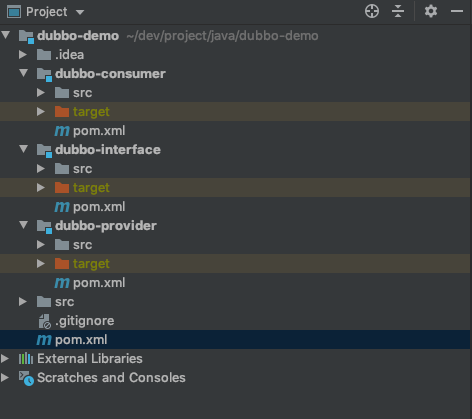
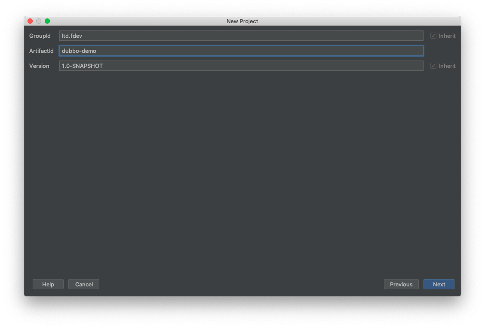

## 1. 新建项目

打开 idea 新建一个 maven 项目。

目录结构如下：


该项目为父项目！

---

> 注意其 pom.xml 文件：

```
<?xml version="1.0" encoding="UTF-8"?>
<project xmlns="http://maven.apache.org/POM/4.0.0"
         xmlns:xsi="http://www.w3.org/2001/XMLSchema-instance"
         xsi:schemaLocation="http://maven.apache.org/POM/4.0.0 http://maven.apache.org/xsd/maven-4.0.0.xsd">
    <modelVersion>4.0.0</modelVersion>

    <groupId>ltd.fdev</groupId>
    <artifactId>dubbo-demo</artifactId>
    <version>1.0-SNAPSHOT</version>
    
</project>
```

---

#### 新建 dubbo-interface 子项目

步骤：File -> New -> Module 选 maven 项目即可。


该项目新建完成后，父项目的 pom.xml 被修改了：

```
<?xml version="1.0" encoding="UTF-8"?>
<project xmlns="http://maven.apache.org/POM/4.0.0"
         xmlns:xsi="http://www.w3.org/2001/XMLSchema-instance"
         xsi:schemaLocation="http://maven.apache.org/POM/4.0.0 http://maven.apache.org/xsd/maven-4.0.0.xsd">
    <modelVersion>4.0.0</modelVersion>

    <groupId>ltd.fdev</groupId>
    <artifactId>dubbo-demo</artifactId>
    <packaging>pom</packaging>
    <version>1.0-SNAPSHOT</version>
    <modules>
        <module>dubbo-interface</module>
    </modules>

</project>
```

添加了打包类型声明和子模块声明

```
<packaging>pom</packaging>

<modules>
    <module>dubbo-interface</module>
</modules>
```

> 项目的打包类型有：pom、jar、war，默认为 jar 类型；如果一个项目是其他项目的父项目，则它的类型需要为 pom 类型。

刚刚新建的 dubbo-interface 子项目的 pom.xml 文件里面也有父项目声明：

```
<parent>
    <artifactId>dubbo-demo</artifactId>
    <groupId>ltd.fdev</groupId>
    <version>1.0-SNAPSHOT</version>
</parent>
```

至此，一个 maven 多模块项目就创建成功了。按照同样的方法再创建 dubbo-provider 和 dubbo-consumer 子项目。

最后项目的结构如下：



## 2. 在 dubbo-interface 子项目中定义接口规范

```
public interface HelloService {
    public  String sayHello(String name);
}
```

## 3. 在 dubbo-provider 子项目中实现接口规范并注册服务 + 在 dubbo-consumer 子项目调用服务

##### 3.1 添加依赖

这两个项目都需要添加 dubbo-spring-boot-starter 和 zkclient 依赖：

```
<!--引入dubbo的依赖-->
<dependency>
    <groupId>org.apache.dubbo</groupId>
    <artifactId>dubbo-spring-boot-starter</artifactId>
    <version>2.7.3</version>
</dependency>

<!-- 引入zookeeper的依赖 -->
<dependency>
    <groupId>com.101tec</groupId>
    <artifactId>zkclient</artifactId>
    <version>0.10</version>
</dependency>

```

这两个项目都需要在 application.yaml 中指定 serivce name 和 zookeeper 的地址：

```
spring:
    dubbo:
        application:
            name=dubbo-xxx # dubbo-provider 或 dubbo-consumer
            registry=zookeeper://ip地址:2181
```

##### 3.2 服务提供方

使用 dubbo 的 @Service 注解注释服务：

```
import com.alibaba.dubbo.config.annotation.Service;
import org.springframework.stereotype.Component;

@Component
@Service
public class HelloServiceImpl implements HelloService {
    @Override
    public String sayHello(String name) {
        return "Hello " + name;
    }
}
```

使用 dubbo 的 @EnableDubboConfiguration 注解开启 Dubbo 的自动配置：

```
import com.alibaba.dubbo.spring.boot.annotation.EnableDubboConfiguration;
import org.springframework.boot.SpringApplication;
import org.springframework.boot.autoconfigure.SpringBootApplication;

@SpringBootApplication
@EnableDubboConfiguration // 开启dubbo的自动配置
public class DubboProviderApplication {
    public static void main(String[] args) {
        SpringApplication.run(DubboProviderApplication.class, args);
    }
}
```

##### 3.3 服务消费者

使用 @Reference 注解来引用服务：

```
import com.alibaba.dubbo.config.annotation.Reference;
import org.springframework.web.bind.annotation.RequestMapping;
import org.springframework.web.bind.annotation.RestController;
import top.snailclimb.service.HelloService;

@RestController
public class HelloController {
    @Reference
    private HelloService helloService;

    @RequestMapping("/hello")
    public String hello() {
        String hello = helloService.sayHello("world");
        System.out.println(helloService.sayHello("SnailClimb"));
        return hello;
    }
}
```

使用 dubbo 的 @EnableDubboConfiguration 注解开启 Dubbo 的自动配置：

```
import com.alibaba.dubbo.spring.boot.annotation.EnableDubboConfiguration;
import org.springframework.boot.SpringApplication;
import org.springframework.boot.autoconfigure.SpringBootApplication;

@SpringBootApplication
@EnableDubboConfiguration // 开启dubbo的自动配置
public class DubboConsumerApplication {
    public static void main(String[] args) {
        SpringApplication.run(DubboConsumerApplication.class, args);
    }
}
```

至此，代码全部写完了。

先启动 provider 再启动 consumer，然后服务 `http://localhost:8080/hello` 即可查看效果。

---

## 新建项目步骤





