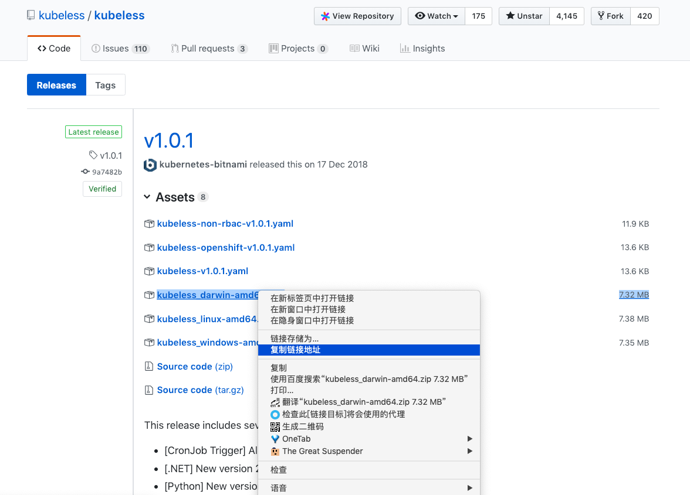

#  安装 v1.0.1

### 1. 安装 kubeless 命令行工具

> 方法一

对于 Windows、Linux 和 macOS，都可以先下载 zip 压缩包，解压，然后将 kubeless 可执行文件复制到 /usr/local/bin/ 目录（Linux 和 macOS），或者将其目录添加到环境变量（Windows）。

在 [https://github.com/kubeless/kubeless/releases](https://github.com/kubeless/kubeless/releases) 页面获取下载链接：



```
$ wget https://github.com/kubeless/kubeless/releases/download/v1.0.1/kubeless_darwin-amd64.zip

$ unzip kubeless_darwin-amd64.zip

$ cp bundles/kubeless_$OS-amd64/kubeless /usr/local/bin/
```

> 方法二

对于 Linux 和 macOS，可以使用如下命令直接安装最新的：

```
# 获取最新的 release 版本号和当前 OS 的类型
$ export RELEASE=$(curl -s https://api.github.com/repos/kubeless/kubeless/releases/latest | grep tag_name | cut -d '"' -f 4)

$ export OS=$(uname -s| tr '[:upper:]' '[:lower:]')

# 下载 zip 压缩包并解压，然后将 kubeless 可执行文件复制到 /usr/local/bin/ 目录
$ curl -OL https://github.com/kubeless/kubeless/releases/download/$RELEASE/kubeless_$OS-amd64.zip && \
    unzip kubeless_$OS-amd64.zip && \
    sudo cp bundles/kubeless_$OS-amd64/kubeless /usr/local/bin/
```

---

验证安装是否成功：

```
uxiaosongdeMac-mini:~ fuxiaosong$ kubeless
Serverless framework for Kubernetes

Usage:
  kubeless [command]

Available Commands:
  autoscale         manage autoscale to function on Kubeless
  completion        Output shell completion code for the specified shell.
  function          function specific operations
  get-server-config Print the current configuration of the controller
  help              Help about any command
  topic             manage message topics in Kubeless
  trigger           trigger specific operations
  version           Print the version of Kubeless

Flags:
  -h, --help   help for kubeless

Use "kubeless [command] --help" for more information about a command.
fuxiaosongdeMac-mini:~ fuxiaosong$
```

### 2. 在 kubernetes 集群中安装 kubeless

先创建 `kubeless` 命名空间，kubeless 应用默认使用该命名空间：

```
$ kubectl create namespace kubeless
```

然后通过 yaml 配置文件安装 kubeless，安装完成后会创建 `Functions` CRD，并启动一个 Controller：

```
# 启用 RBAC:
$ kubectl create -f https://github.com/kubeless/kubeless/releases/download/v1.0.1/kubeless-v1.0.1.yaml 

# 不启用 RBAC:
$ kubectl create -f https://github.com/kubeless/kubeless/releases/download/v1.0.1/kubeless-non-rbac-v1.0.1.yaml 
```

> 我在安装的时候，安装 `不启用 RBAC` 一直失败，安装 `启用 RBAC` 才成功了。

命令执行过程记录：

```
[root@dockerapp ~]# kubectl create namespace kubeless
namespace/kubeless created
[root@dockerapp ~]# kubectl get namespaces
NAME          STATUS   AGE
default       Active   6d4h
kube-public   Active   6d4h
kube-system   Active   6d4h
kubeless      Active   6s
[root@dockerapp ~]# kubectl create -f https://github.com/kubeless/kubeless/releases/download/v1.0.1/kubeless-v1.0.1.yaml
configmap/kubeless-config created
deployment.apps/kubeless-controller-manager created
serviceaccount/controller-acct created
clusterrole.rbac.authorization.k8s.io/kubeless-controller-deployer created
clusterrolebinding.rbac.authorization.k8s.io/kubeless-controller-deployer created
customresourcedefinition.apiextensions.k8s.io/functions.kubeless.io created
customresourcedefinition.apiextensions.k8s.io/httptriggers.kubeless.io created
customresourcedefinition.apiextensions.k8s.io/cronjobtriggers.kubeless.io created
[root@dockerapp ~]#
```

使用 `kubectl` 命令查看安装情况：

```
[root@dockerapp ~]# kubectl get deployments -n kubeless
NAME                          READY   UP-TO-DATE   AVAILABLE   AGE
kubeless-controller-manager   0/1     1            0           2m47s

[root@dockerapp ~]# kubectl get replicasets -n kubeless
NAME                                     DESIRED   CURRENT   READY   AGE
kubeless-controller-manager-7c7bcb8db4   1         1         0       27m

[root@dockerapp ~]# kubectl get services -n kubeless
No resources found.

[root@dockerapp ~]# kubectl get pods -n kubeless
NAME                                           READY   STATUS             RESTARTS   AGE
kubeless-controller-manager-7c7bcb8db4-jnr69   0/3     CrashLoopBackOff   9          2m36s

[root@dockerapp ~]# kubectl get customresourcedefinitions
NAME                          CREATED AT
cronjobtriggers.kubeless.io   2019-01-23T13:34:58Z
functions.kubeless.io         2019-01-23T13:34:58Z
httptriggers.kubeless.io      2019-01-23T13:34:58Z

[root@dockerapp ~]# kubectl get functions
No resources found.
```

> kubectl describe deployment kubeless-controller-manager -n kubeless

```
[root@dockerapp ~]# kubectl describe deployment kubeless-controller-manager -n kubeless
Name:                   kubeless-controller-manager
Namespace:              kubeless
CreationTimestamp:      Wed, 23 Jan 2019 21:34:58 +0800
Labels:                 kubeless=controller
Annotations:            deployment.kubernetes.io/revision: 1
Selector:               kubeless=controller
Replicas:               1 desired | 1 updated | 1 total | 0 available | 1 unavailable
StrategyType:           RollingUpdate
MinReadySeconds:        0
RollingUpdateStrategy:  25% max unavailable, 25% max surge
Pod Template:
  Labels:           kubeless=controller
  Service Account:  controller-acct
  Containers:
   kubeless-function-controller:
    Image:      kubeless/function-controller:v1.0.1
    Port:       <none>
    Host Port:  <none>
    Environment:
      KUBELESS_INGRESS_ENABLED:  <set to the key 'ingress-enabled' of config map 'kubeless-config'>  Optional: false
      KUBELESS_SERVICE_TYPE:     <set to the key 'service-type' of config map 'kubeless-config'>     Optional: false
      KUBELESS_NAMESPACE:         (v1:metadata.namespace)
      KUBELESS_CONFIG:           kubeless-config
    Mounts:                      <none>
   http-trigger-controller:
    Image:      bitnami/http-trigger-controller:v1.0.0-alpha.9
    Port:       <none>
    Host Port:  <none>
    Environment:
      KUBELESS_INGRESS_ENABLED:  <set to the key 'ingress-enabled' of config map 'kubeless-config'>  Optional: false
      KUBELESS_SERVICE_TYPE:     <set to the key 'service-type' of config map 'kubeless-config'>     Optional: false
      KUBELESS_NAMESPACE:         (v1:metadata.namespace)
      KUBELESS_CONFIG:           kubeless-config
    Mounts:                      <none>
   cronjob-trigger-controller:
    Image:      bitnami/cronjob-trigger-controller:v1.0.0
    Port:       <none>
    Host Port:  <none>
    Environment:
      KUBELESS_INGRESS_ENABLED:  <set to the key 'ingress-enabled' of config map 'kubeless-config'>  Optional: false
      KUBELESS_SERVICE_TYPE:     <set to the key 'service-type' of config map 'kubeless-config'>     Optional: false
      KUBELESS_NAMESPACE:         (v1:metadata.namespace)
      KUBELESS_CONFIG:           kubeless-config
    Mounts:                      <none>
  Volumes:                       <none>
Conditions:
  Type           Status  Reason
  ----           ------  ------
  Available      False   MinimumReplicasUnavailable
  Progressing    True    ReplicaSetUpdated
OldReplicaSets:  <none>
NewReplicaSet:   kubeless-controller-manager-7c7bcb8db4 (1/1 replicas created)
Events:
  Type    Reason             Age    From                   Message
  ----    ------             ----   ----                   -------
  Normal  ScalingReplicaSet  5m46s  deployment-controller  Scaled up replica set kubeless-controller-manager-7c7bcb8db4 to 1
[root@dockerapp ~]#
```

> kubectl describe replicaset kubeless-controller-manager-7c7bcb8db4 -n kubeless

```
[root@dockerapp ~]# kubectl describe replicaset kubeless-controller-manager-7c7bcb8db4 -n kubeless
Name:           kubeless-controller-manager-7c7bcb8db4
Namespace:      kubeless
Selector:       kubeless=controller,pod-template-hash=7c7bcb8db4
Labels:         kubeless=controller
                pod-template-hash=7c7bcb8db4
Annotations:    deployment.kubernetes.io/desired-replicas: 1
                deployment.kubernetes.io/max-replicas: 2
                deployment.kubernetes.io/revision: 1
Controlled By:  Deployment/kubeless-controller-manager
Replicas:       1 current / 1 desired
Pods Status:    1 Running / 0 Waiting / 0 Succeeded / 0 Failed
Pod Template:
  Labels:           kubeless=controller
                    pod-template-hash=7c7bcb8db4
  Service Account:  controller-acct
  Containers:
   kubeless-function-controller:
    Image:      kubeless/function-controller:v1.0.1
    Port:       <none>
    Host Port:  <none>
    Environment:
      KUBELESS_INGRESS_ENABLED:  <set to the key 'ingress-enabled' of config map 'kubeless-config'>  Optional: false
      KUBELESS_SERVICE_TYPE:     <set to the key 'service-type' of config map 'kubeless-config'>     Optional: false
      KUBELESS_NAMESPACE:         (v1:metadata.namespace)
      KUBELESS_CONFIG:           kubeless-config
    Mounts:                      <none>
   http-trigger-controller:
    Image:      bitnami/http-trigger-controller:v1.0.0-alpha.9
    Port:       <none>
    Host Port:  <none>
    Environment:
      KUBELESS_INGRESS_ENABLED:  <set to the key 'ingress-enabled' of config map 'kubeless-config'>  Optional: false
      KUBELESS_SERVICE_TYPE:     <set to the key 'service-type' of config map 'kubeless-config'>     Optional: false
      KUBELESS_NAMESPACE:         (v1:metadata.namespace)
      KUBELESS_CONFIG:           kubeless-config
    Mounts:                      <none>
   cronjob-trigger-controller:
    Image:      bitnami/cronjob-trigger-controller:v1.0.0
    Port:       <none>
    Host Port:  <none>
    Environment:
      KUBELESS_INGRESS_ENABLED:  <set to the key 'ingress-enabled' of config map 'kubeless-config'>  Optional: false
      KUBELESS_SERVICE_TYPE:     <set to the key 'service-type' of config map 'kubeless-config'>     Optional: false
      KUBELESS_NAMESPACE:         (v1:metadata.namespace)
      KUBELESS_CONFIG:           kubeless-config
    Mounts:                      <none>
  Volumes:                       <none>
Events:
  Type    Reason            Age   From                   Message
  ----    ------            ----  ----                   -------
  Normal  SuccessfulCreate  10m   replicaset-controller  Created pod: kubeless-controller-manager-7c7bcb8db4-jnr69
[root@dockerapp ~]#
```

> kubectl describe pod kubeless-controller-manager-7c7bcb8db4-jnr69 -n kubeless

```
[root@dockerapp ~]# kubectl describe pod kubeless-controller-manager-7c7bcb8db4-jnr69 -n kubeless
Name:               kubeless-controller-manager-7c7bcb8db4-jnr69
Namespace:          kubeless
Priority:           0
PriorityClassName:  <none>
Node:               maven/192.168.160.13
Start Time:         Wed, 23 Jan 2019 21:34:58 +0800
Labels:             kubeless=controller
                    pod-template-hash=7c7bcb8db4
Annotations:        <none>
Status:             Running
IP:                 10.244.2.5
Controlled By:      ReplicaSet/kubeless-controller-manager-7c7bcb8db4
Containers:
  kubeless-function-controller:
    Container ID:   docker://5b8fff890c5d6fdc4488dbcdd75d444e4569ebec04791091e90bb4a4f603892d
    Image:          kubeless/function-controller:v1.0.1
    Image ID:       docker-pullable://kubeless/function-controller@sha256:949579a06118382b7e033e87779807f85d4efccd8169bffdf532e2d7cb62af37
    Port:           <none>
    Host Port:      <none>
    State:          Waiting
      Reason:       CrashLoopBackOff
    Last State:     Terminated
      Reason:       Error
      Exit Code:    1
      Started:      Wed, 23 Jan 2019 21:47:15 +0800
      Finished:     Wed, 23 Jan 2019 21:47:15 +0800
    Ready:          False
    Restart Count:  7
    Environment:
      KUBELESS_INGRESS_ENABLED:  <set to the key 'ingress-enabled' of config map 'kubeless-config'>  Optional: false
      KUBELESS_SERVICE_TYPE:     <set to the key 'service-type' of config map 'kubeless-config'>     Optional: false
      KUBELESS_NAMESPACE:        kubeless (v1:metadata.namespace)
      KUBELESS_CONFIG:           kubeless-config
    Mounts:
      /var/run/secrets/kubernetes.io/serviceaccount from controller-acct-token-bcqq9 (ro)
  http-trigger-controller:
    Container ID:   docker://18c709468d485cf9e089e5714bd46c1f940183177eef5e2e9ddb17452d5dbffd
    Image:          bitnami/http-trigger-controller:v1.0.0-alpha.9
    Image ID:       docker-pullable://bitnami/http-trigger-controller@sha256:1658f3d55661bd0adee2af62a17f3d943ca6e19863339a58e83ef68beee0247e
    Port:           <none>
    Host Port:      <none>
    State:          Waiting
      Reason:       CrashLoopBackOff
    Last State:     Terminated
      Reason:       Error
      Exit Code:    1
      Started:      Wed, 23 Jan 2019 21:47:16 +0800
      Finished:     Wed, 23 Jan 2019 21:47:16 +0800
    Ready:          False
    Restart Count:  7
    Environment:
      KUBELESS_INGRESS_ENABLED:  <set to the key 'ingress-enabled' of config map 'kubeless-config'>  Optional: false
      KUBELESS_SERVICE_TYPE:     <set to the key 'service-type' of config map 'kubeless-config'>     Optional: false
      KUBELESS_NAMESPACE:        kubeless (v1:metadata.namespace)
      KUBELESS_CONFIG:           kubeless-config
    Mounts:
      /var/run/secrets/kubernetes.io/serviceaccount from controller-acct-token-bcqq9 (ro)
  cronjob-trigger-controller:
    Container ID:   docker://829559e068ffbcf8a3f90a21ceab055e13a2f0534360c904e9f2622c73a649cc
    Image:          bitnami/cronjob-trigger-controller:v1.0.0
    Image ID:       docker-pullable://bitnami/cronjob-trigger-controller@sha256:23d3583825d01a294cb592c31da52f7242819206890e047b021c5ac8616ee099
    Port:           <none>
    Host Port:      <none>
    State:          Waiting
      Reason:       CrashLoopBackOff
    Last State:     Terminated
      Reason:       Error
      Exit Code:    1
      Started:      Wed, 23 Jan 2019 21:47:16 +0800
      Finished:     Wed, 23 Jan 2019 21:47:16 +0800
    Ready:          False
    Restart Count:  7
    Environment:
      KUBELESS_INGRESS_ENABLED:  <set to the key 'ingress-enabled' of config map 'kubeless-config'>  Optional: false
      KUBELESS_SERVICE_TYPE:     <set to the key 'service-type' of config map 'kubeless-config'>     Optional: false
      KUBELESS_NAMESPACE:        kubeless (v1:metadata.namespace)
      KUBELESS_CONFIG:           kubeless-config
    Mounts:
      /var/run/secrets/kubernetes.io/serviceaccount from controller-acct-token-bcqq9 (ro)
Conditions:
  Type              Status
  Initialized       True
  Ready             False
  ContainersReady   False
  PodScheduled      True
Volumes:
  controller-acct-token-bcqq9:
    Type:        Secret (a volume populated by a Secret)
    SecretName:  controller-acct-token-bcqq9
    Optional:    false
QoS Class:       BestEffort
Node-Selectors:  <none>
Tolerations:     node.kubernetes.io/not-ready:NoExecute for 300s
                 node.kubernetes.io/unreachable:NoExecute for 300s
Events:
  Type     Reason     Age                  From               Message
  ----     ------     ----                 ----               -------
  Normal   Scheduled  13m                  default-scheduler  Successfully assigned kubeless/kubeless-controller-manager-7c7bcb8db4-jnr69 to maven
  Normal   Pulling    13m                  kubelet, maven     pulling image "kubeless/function-controller:v1.0.1"
  Normal   Pulling    12m                  kubelet, maven     pulling image "bitnami/http-trigger-controller:v1.0.0-alpha.9"
  Normal   Pulled     12m                  kubelet, maven     Successfully pulled image "kubeless/function-controller:v1.0.1"
  Normal   Pulled     12m                  kubelet, maven     Successfully pulled image "bitnami/http-trigger-controller:v1.0.0-alpha.9"
  Normal   Pulling    12m                  kubelet, maven     pulling image "bitnami/cronjob-trigger-controller:v1.0.0"
  Normal   Pulled     12m                  kubelet, maven     Successfully pulled image "bitnami/cronjob-trigger-controller:v1.0.0"
  Normal   Pulled     12m                  kubelet, maven     Container image "kubeless/function-controller:v1.0.1" already present on machine
  Normal   Started    12m (x2 over 12m)    kubelet, maven     Started container
  Normal   Created    12m (x2 over 12m)    kubelet, maven     Created container
  Normal   Pulled     12m                  kubelet, maven     Container image "bitnami/http-trigger-controller:v1.0.0-alpha.9" already present on machine
  Normal   Created    12m (x2 over 12m)    kubelet, maven     Created container
  Normal   Started    12m (x2 over 12m)    kubelet, maven     Started container
  Normal   Created    12m (x2 over 12m)    kubelet, maven     Created container
  Normal   Started    12m (x2 over 12m)    kubelet, maven     Started container
  Normal   Pulled     12m                  kubelet, maven     Container image "bitnami/cronjob-trigger-controller:v1.0.0" already present on machine
  Warning  BackOff    12m                  kubelet, maven     Back-off restarting failed container
  Warning  BackOff    12m                  kubelet, maven     Back-off restarting failed container
  Warning  BackOff    3m1s (x47 over 12m)  kubelet, maven     Back-off restarting failed container
[root@dockerapp ~]#
```

---

总结：

Deployment `kubeless-controller-manager` 下有一个 ReplicaSet `kubeless-controller-manager-7c7bcb8db4`，它下面有一个 Pod `kubeless-controller-manager-7c7bcb8db4-jnr69`，这个 Pod 里面有三个 Container，分别为：kubeless-function-controller（image 为 kubeless/function-controller:v1.0.1）、http-trigger-controller（image 为 bitnami/http-trigger-controller:v1.0.0-alpha.9）、cronjob-trigger-controller（image 为 bitnami/cronjob-trigger-controller:v1.0.0）

```
[root@dockerapp ~]# docker pull kubeless/function-controller:v1.0.1
v1.0.1: Pulling from kubeless/function-controller
ad2b0e07c2f7: Pull complete
4800cc9d0f01: Pull complete
7bf7a47b6cef: Pull complete
Digest: sha256:949579a06118382b7e033e87779807f85d4efccd8169bffdf532e2d7cb62af37
Status: Downloaded newer image for kubeless/function-controller:v1.0.1

[root@dockerapp ~]# docker pull bitnami/cronjob-trigger-controller:v1.0.0
v1.0.0: Pulling from bitnami/cronjob-trigger-controller
903f529a3454: Pull complete
346fcd86b8f5: Pull complete
Digest: sha256:23d3583825d01a294cb592c31da52f7242819206890e047b021c5ac8616ee099
Status: Downloaded newer image for bitnami/cronjob-trigger-controller:v1.0.0

[root@dockerapp ~]# docker pull bitnami/http-trigger-controller:v1.0.0-alpha.9
v1.0.0-alpha.9: Pulling from bitnami/http-trigger-controller
8e81ef1cdd5b: Pull complete
824ef349c084: Pull complete
df28d9caec3e: Pull complete
Digest: sha256:1658f3d55661bd0adee2af62a17f3d943ca6e19863339a58e83ef68beee0247e
Status: Downloaded newer image for bitnami/http-trigger-controller:v1.0.0-alpha.9
```

* https://hub.docker.com/r/kubeless/function-controller/tags
* https://hub.docker.com/r/bitnami/http-trigger-controller/tags
* https://hub.docker.com/r/bitnami/cronjob-trigger-controller/tags

### 3. 卸载 kubeless

卸载 kubeless 很简单，使用 `kubectl delete` 命令即可：

```
kubectl delete -f https://github.com/kubeless/kubeless/releases/download/v1.0.1/kubeless-v1.0.1.yaml
```

### 4. hello kubeless

先创建一个 hello.py 文件，保存如下内容：

```
def hello(event, context):
  print event
  return event['data']
```

然后使用 `kubeless function deploy` 命令部署该 function：

```
[root@dockerapp kubeless-functions]# kubeless function deploy hello --runtime python2.7 \
>                                 --from-file hello.py \
>                                 --handler hello.hello
INFO[0000] Deploying function...
INFO[0000] Function hello submitted for deployment
INFO[0000] Check the deployment status executing 'kubeless function ls hello'
[root@dockerapp kubeless-functions]# kubeless function list hello
NAME 	NAMESPACE	HANDLER    	RUNTIME  	DEPENDENCIES	STATUS
hello	default  	hello.hello	python2.7	            	1/1 READY
[root@dockerapp kubeless-functions]#
```

可以使用 `kubeless function list` 查看已经部署的 function：

```
[root@dockerapp kubeless-functions]# kubeless function list
NAME 	NAMESPACE	HANDLER    	RUNTIME  	DEPENDENCIES	STATUS
hello	default  	hello.hello	python2.7	            	1/1 READY

[root@dockerapp kubeless-functions]# kubectl get functions
NAME    AGE
hello   4m
[root@dockerapp kubeless-functions]# 
```

接着使用 `kubeless function call` 命令调用该 function：

```
[root@dockerapp kubeless-functions]# kubeless function call hello --data 'Hello kubeless'
Hello kubeless
[root@dockerapp kubeless-functions]#
```

最后使用 `kubeless function delete` 命令删除部署的 function：

```
[root@dockerapp kubeless-functions]# kubeless function delete hello
[root@dockerapp kubeless-functions]# kubeless function list
NAME	NAMESPACE	HANDLER	RUNTIME	DEPENDENCIES	STATUS
[root@dockerapp kubeless-functions]#
```

---

参考：

* https://kubeless.io/docs/quick-start/