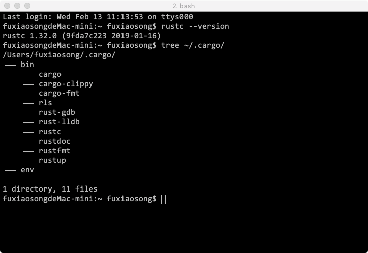

Rust 编译器的下载和安装方法在官网上有文档说明，点击官网上的 `Install` 链接可以查看。Rust 官方已经提供了预编译好的编译器供我们下载，支持 Windows 平台、Linux 平台以及 Mac 平台。但是一般我们不单独下载 Rust 的编译器，而是使用一个叫 `rustup` 的工具安装 Rust 相关的一整套工具链，包括编译器、标准库、cargo 等。使用这个工具，我们还可以轻易地更新版本、切换渠道、多工具链管理等。

## 0. 设置国内代理

为了提高访问速度，中国科技大学 Linux 用户协会（USTC LUG）提供了一个代理服务，官方网址：[Rust Toolchain 反向代理使用帮助](https://mirrors.ustc.edu.cn/help/rust-static.html)，建议设置好以下环境变量后再使用 rustup。编辑文件 `vi ~/.bash_profile`，并添加以下内容：

```
export RUSTUP_DIST_SERVER=https://mirrors.ustc.edu.cn/rust-static
export RUSTUP_UPDATE_ROOT=https://mirrors.ustc.edu.cn/rust-static/rustup
```

环境变量 `RUSTUP_DIST_SERVER` 用于更新 `toolchain`，`RUSTUP_UPDATE_ROOT` 用于更新 `rustup`。

> 为 cargo 设置代理，参考：https://mirrors.ustc.edu.cn/help/crates.io-index.html

rust 官方工具链还提供了重要的包管理工具 `cargo`，我们可以通过这个工具轻松导入或者发布开源库。官方的管理仓库在 `https://crates.io/`。

大型项目往往需要依赖这些开源库，cargo 会帮我们自动下载编译。

同样，为了解决网络问题，需要利用 USTC 提供的代理服务，使用方式为：通过命令 `vi $HOME/.cargo/config` 在 `$HOME/.cargo` 目录下创建一个名为 `config` 的文本文件，其内容为：

```
[source.crates-io]
replace-with = 'ustc'

[source.ustc]
registry = "https://mirrors.ustc.edu.cn/crates.io-index"
```

这样，在编译需要依赖 `crates.io` 的项目时，不会由于网络问题导致依赖库下载失败。

## 1. 安装 

要下载 Rustup 并安装 Rust，请在终端中运行以下命令，然后按照屏幕上的说明进行操作：

```
curl https://sh.rustup.rs -sSf | sh
```

> 如果下载卡住了，可以先下载 `https://sh.rustup.rs` 脚本文件（下载下来的文件名为 `rustup-init.sh`），将里面的 `RUSTUP_UPDATE_ROOT` 变量改为 `https://mirrors.ustc.edu.cn/rust-static/rustup`，然后再执行这个脚本文件(`rustup-init.sh`)即可。

`rustup` 将 rustc，cargo，rustup 和其他标准工具(如 rustfmt、rustdoc 等)安装到 Cargo 的 `bin` 目录中。在 Unix 上，它位于 `$HOME/.cargo/bin`，在 Windows 上位于 `％USERPROFILE％\.cargo\bin`。这也是 `cargo install` 命令安装 Rust 程序和 Cargo 插件的目录。此目录将位于 `$PATH` 环境变量中，这意味着您可以从 shell 运行它们而无需进一步配置。打开一个新 shell 并键入以下内容：

```
rustc --version
```

如果你看到像 `rustc 1.32.0 (9fda7c223 2019-01-16)`这样的东西，你就准备好了。如：

```
fuxiaosongdeMac-mini:~ fuxiaosong$ rustc --version
rustc 1.32.0 (9fda7c223 2019-01-16)
```

安装完成后，在 `$HOME/.cargo/bin` 目录下可以看到一系列的可执行文件，如图：



其中：
* rustc 是编译器
* cargo 是包管理器
* rustup 是管理这套工具链下载更新的工具
* cargo-fmt 和 rustfmt 是源代码格式化工具
* rustdoc 是文档生成器
* cargo-clippy 是 lint 工具
* rust-gdb 和 rust-lldb 是调试器
* rls 是为编辑器准备的代码提示工具

命令执行记录：

```
fuxiaosongdeMac-mini:~ fuxiaosong$ curl https://sh.rustup.rs -sSf | sh
info: downloading installer

Welcome to Rust!

This will download and install the official compiler for the Rust programming
language, and its package manager, Cargo.

It will add the cargo, rustc, rustup and other commands to Cargo's bin
directory, located at:

  /Users/fuxiaosong/.cargo/bin

This path will then be added to your PATH environment variable by modifying the
profile files located at:

  /Users/fuxiaosong/.profile
  /Users/fuxiaosong/.bash_profile

You can uninstall at any time with rustup self uninstall and these changes will
be reverted.

Current installation options:

   default host triple: x86_64-apple-darwin
     default toolchain: stable
  modify PATH variable: yes

1) Proceed with installation (default)
2) Customize installation
3) Cancel installation
>

info: syncing channel updates for 'stable-x86_64-apple-darwin'
info: latest update on 2019-01-17, rust version 1.32.0 (9fda7c223 2019-01-16)
info: downloading component 'rustc'
 64.5 MiB /  64.5 MiB (100 %)   2.0 MiB/s ETA:   0 s
info: downloading component 'rust-std'
 49.2 MiB /  49.2 MiB (100 %)   1.9 MiB/s ETA:   0 s
info: downloading component 'cargo'
  3.4 MiB /   3.4 MiB (100 %)   2.1 MiB/s ETA:   0 s
info: downloading component 'rust-docs'
  8.5 MiB /   8.5 MiB (100 %)   2.0 MiB/s ETA:   0 s
info: installing component 'rustc'
info: installing component 'rust-std'
info: installing component 'cargo'
info: installing component 'rust-docs'
info: default toolchain set to 'stable'

  stable installed - rustc 1.32.0 (9fda7c223 2019-01-16)


Rust is installed now. Great!

To get started you need Cargo's bin directory ($HOME/.cargo/bin) in your PATH
environment variable. Next time you log in this will be done automatically.

To configure your current shell run source $HOME/.cargo/env
fuxiaosongdeMac-mini:~ fuxiaosong$
```

## 2. 升级

如果您通过 `rustup` 安装了以前版本的 Rust，那么升级只需要一条命令：

```
$ rustup update stable
```

## 3. 卸载

如果你认为 Rust 不是你的东西，你可以通过运行 `rustup self uninstall` 将它从你的系统中完全删除。

```
rustup self uninstall
```